# 28. Feladatmegoldási stratégiák

`
Rekurzió. Oszd meg és uralkodj stratégia. Visszalépéses keresés, kiválogatás, maximum-kiválasztás. Mohó stratégia. Dinamikus programozás.
`

## Témák:

- Rekurzió / Recursion
- Dinamikus programozás / Dynamic programming
- Visszalépéses keresés / Backtracking
- Mohó stratégia / Greedy algorithms
- Oszd meg és uralkodj / Divide-and-conquer algorithm

- kiválogatás (???)
- maxmimum kiválasztás (???)

## Rekurzió

Mi a rekurzió?

A számítástechnikában a rekurzió egy számítási probléma megoldásának módszere, ahol a megoldás ugyanazon probléma kisebb példányainak megoldásán múlik.
A rekurzió az ilyen rekurzív problémákat olyan függvények használatával oldja meg, amelyek saját kódjukból hívják meg magukat. A megközelítés számos problématípusra alkalmazható, és a rekurzió a számítástechnika egyik központi gondolata.

A rekurzió ereje abban rejlik, hogy egy végtelen objektumhalmazt véges utasítással definiálhatunk. Ugyanígy végtelen számú számítás leírható egy véges rekurzív programmal, még akkor is, ha ez a program nem tartalmaz kifejezett ismétléseket.

Ha egy függvényt önmagából ismételten hívunk meg, akkor a hívási verem mérete megegyezik az összes érintett hívás bemeneti méretének összegével.
Ebből következik, hogy az iterációval könnyen megoldható problémák esetében a rekurzió általában kevésbé hatékony,
és nagy problémák esetén alapvetően fontos olyan optimalizálási technikák alkalmazása, mint a farokhívás optimalizálás (Tail-Call Recursion Optimization).

### Érvek a rekurzió mellett

- A rekurzió egy implicit vermet + ciklust használ, ezért azt nem kell leimplementálni a kódunkban,
ezáltal csökken a komplex ciklusok és az ilyen kiegészítő adatszerkezetek használata.
- A komplexitás könnyen csökkenhető `memorizálással`, mivel így a redundáns hívások megszüntethetőek, lásd később.: `Dinamikus programozás`
- Nagyon jól működik a rekurzívan definiált struktúrákkal pl.: JSON objektumok, fák, gráfok; dolgok amik hagyják,
hogy egy időben egyszerre tudj foglalkozni az adattípus egy egységével.
- Gráfok, fák mélységi bejárásához szükségünk van egy verem adatszerkezetre, de mivel a rekurzió ezt implicit megcsinálja nekünk,
nem kell az implementálással foglalkozni, és szebb lesz a kódunk:

#### Egy gráf mélységi bejárás ciklussal + veremmel (no recursion):

```cs
void DepthFirstPrint(Dictionary<char, List<char>> graph, char source)
{
    Stack<char> stack = new Stack<char>();
    stack.Push(source);
    while (stack.Count > 0)
    {
        char current = stack.Pop();
        Console.Write(current + ", "); //adat kiírása a gráfban
        foreach (char neighbor in graph[current])
        {
            stack.Push(neighbor);
        }
    }
}
```

#### Rekurzívan:

```cs
void DepthFirstRecursive(Dictionary<char, List<char>> graph, char source)
{
    Console.Write(source + ", "); //adat kiírása a gráfban
    foreach (char neighbor in graph[source])
    {
        DepthFirstRecursive(graph, neighbor);
    }
}
```

### Érvek a rekurzió ellen

- Lassúság a CPU többletterhelése miatt, amit a sok method
hívás okoz a `call stack`-en. Metódusokat hívni lasabb, mint egy iterálni egy ciklusban,
ezért itt mérlegelnünk kell.
- A rekurziónál rendszerverem memória (`system stack`) szükséges a paraméterek
és lokális változók tárolására a veremben lévő függvény minden egyes példányához. 
- A ciklus nem igényel állandó mennyiségű helyi változót, mivel csak egy példánya van a veremben.
- A rekurzió verem túlcsorduláshoz vezethet, ha a mélység (depth) elég nagy. Ez a paraméterek számától és típusától is függ
(egy objektumra való hivatkozás kevesebb helyet igényel, mint a teljes objektum átadása).

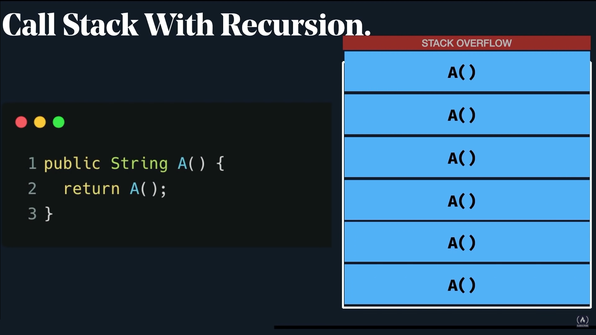

### Fibonacci: 1, 1, 2, 3, 5, 8, 13, 21, 34, 55, 89, 144...

Az egyetem kedvenc rekurzív példája a `n-edik` fibonacci szám. <br>
Ugye az `n-edik` fibonacci számot úgy kapjuk meg, hogy összeadjuk az `n-1` és `n-2`-edik fib számot.

```cs
long Fib(int n)
{
    return Fib(n - 1) + Fib(n - 2);
}
```

Ez szép is lenne, de nyilván észrevetted, hogy a kilépési feltétel elmaradt, ezért meghalunk Stackoverflow által.

A javítás:

```cs
long Fib(int n)
{
    if (n <= 2) return 1;
    return Fib(n - 1) + Fib(n - 2);
}

Console.WriteLine(Fib(1)); //1
Console.WriteLine(Fib(2)); //1
Console.WriteLine(Fib(10)); //55
Console.WriteLine(Fib(40)); //102334155
Console.WriteLine(Fib(50)); //
```

Na szóval. Ha ezt lefuttattad fejbe, akkor láthatod, hogy a 50-edik fib számot már nem igen akarja kiszámolni.
Hát de mé nem?

Nyilván valami gikszer van az algoritmusunkkal, és hogy könnyebben tudjunk optimalizálni, rajzoljuk fel, hogy mik történnek itt a háttérben.
És a rekurzív feladatokat mégpedig egy **fa** adatstruktúrában érdemes felrajzolni.


Én itt most megállnék kicsit értelmezni a képet.

- Tehát első körben meghívjuk a fib függvényt 7-tel `fib(7)`
- Ő eljut a 3. sorba, és meghívja 6-tal `fib(6)`
- `fib(5)`
- `fib(4)`
- `fib(3)`
- `fib(2)`
- majd a `fib(2)` visszatér 1-gyel
- majd `fib(1)` (nézd az ábrát) is visszatér 1-gyel
- így a `fib(3)` függvény most a kiértékelt `fib(n-1) + fib(n-2)` azaz `2 + 1`-el tér vissza
- és a `fib(4)` is meghívja a `fib(2)`-t
- Hmm a `fib(2)`-t már egyszer kiszámoltuk, de itt kiszámoljuk még 1x.
- Ha mégjobban megnézzük a képet, látjuk, hogy a `fib(4)`-et 3 helyen is kiszámoljuk, amikor teljesen felesleges, hiszen már az elején megtudjuk, hogy a `fib(4)` az 3

És most képzeljük el, hogy a `Fib(40)`-ben mennyi ilyen ágat kell bejárnunk teljesen feleslegesen.

Ennek a brute force megoldásnak a hely-idő komplexitása `O(2^n)`, ami egy exponenciális grafikon. 

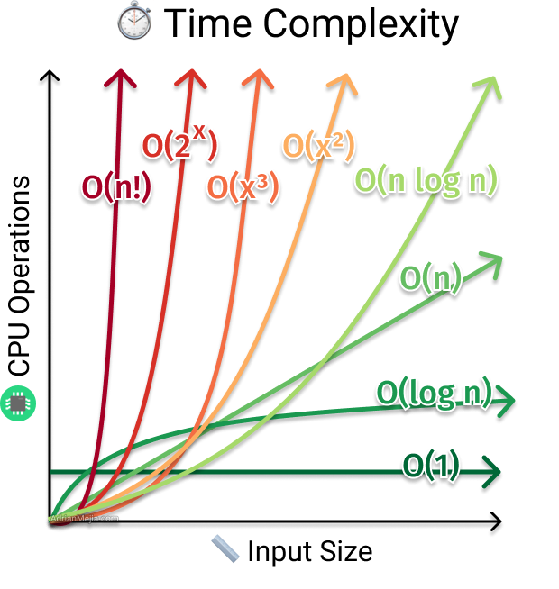

A `Big O Notation`-nek lényege, hogy az algoritmusunk számítási igénye hogyan változik a bemeneti érték növelésével.

Egy tömbben való elem megkeresése végig iterálással például egy lineáris `O(n)` algoritmus, mivel legrosszabb esetben 
az egész tömbön végig kell mennünk mire megtaláljuk az elemet. <br>
Tehát a tömb elemszáma a kétszeresére nő, akkor a fútatási idő is csak kétszereződni fog.

A `O(2^x)` piros vonal viszont itt azt mutatja nekünk, hogy ebben a fibonacci esetében, hogy ezt a `n`-t ha növeljük,
a futási idő brutálisan megnövekedik. Ezért veszélyesek az ilyen algoritmusok. Úgy tűnhetnek, hogy jól működnek, viszont nagy bementi adatnál pedig meghalnak.

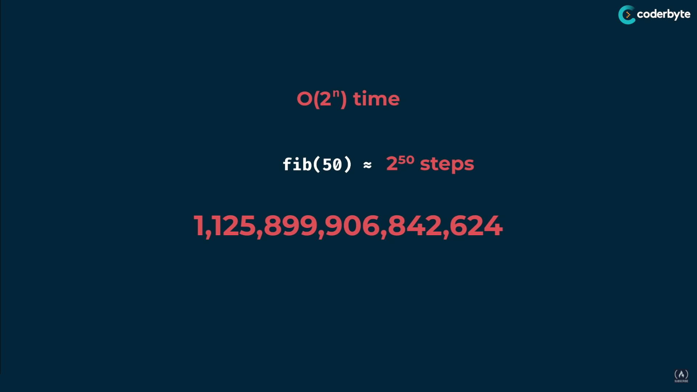

`O(1)` konstans idejű program azt jelenti, hogy bemeneti adatból függetlenül mindig 1 lépes lesz a kimenet előállítása.
Ilyen például egy tömb egy értékének kiírása `Console.WriteLine(array[^1])`

#### `O(log n)`

És ha már rekurziónál vagyunk érdemes megnézni egy `O(log n)` példát is, jellemzően ez a space-time komplexitás az, amire az algoritmusainkat optimalizálni szeretnénk.

A grafikonból kiderülhet, hogy a `O(log n)` komplexitás azt jelenti, hogy:
- ha a bemenet a duplájára nő, akkor az operációk száma (futási idő mondjuk) csak 1 egységgel fog nőni.

Erre jó példa a logaritmikus keresés, angolul `Binary Search`. Ezzel találkozni fogsz az Oszd meg és uralkodj stratégia résznél.


### Grid Travel

Nézzünk egy másik feladatot.

```cs
Van egy 2D tábla. A bal felső sarokban vagy, és a cél az, hogy a jobb alsó sarokba eljussál, de csak lefelé vagy jobbra mozoghatsz.

Hányféleképpen lehet eljutni a célig egy N*M méretű táblában?
```

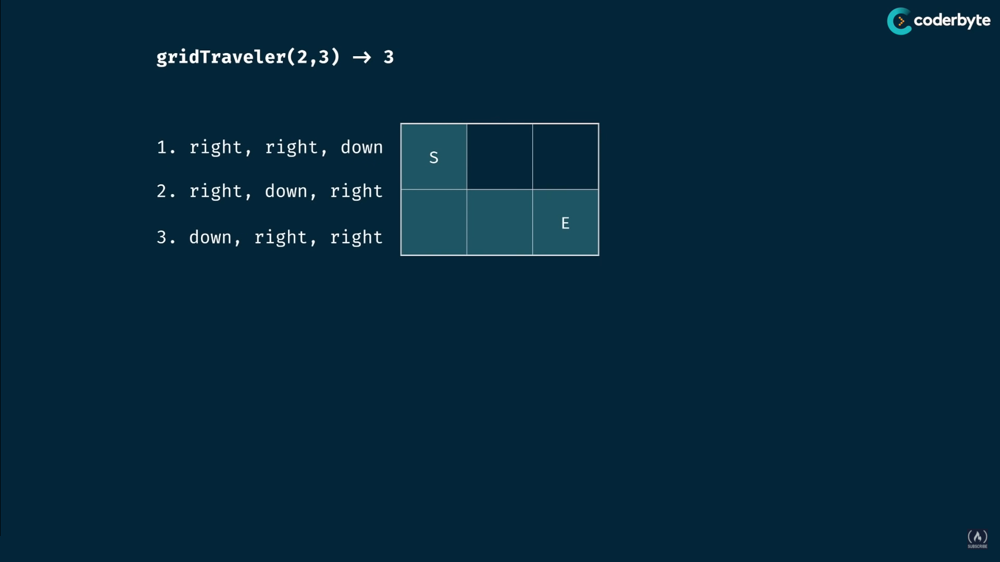 

Ezen a `2x3`-as táblán 3 féle módon juthatunk el a célig `S->E`

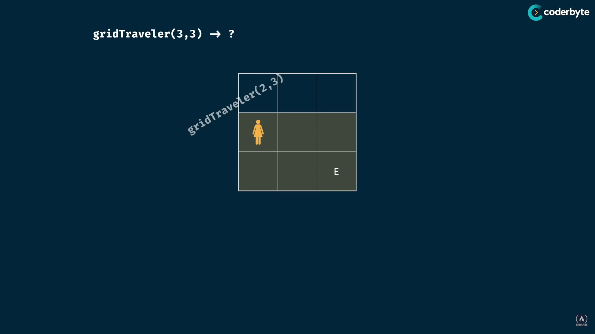

Ahhoz, hogy a `3x3`-as táblát is kiszámoljuk, előtte ki kell számolni  a `2*3`-as-t

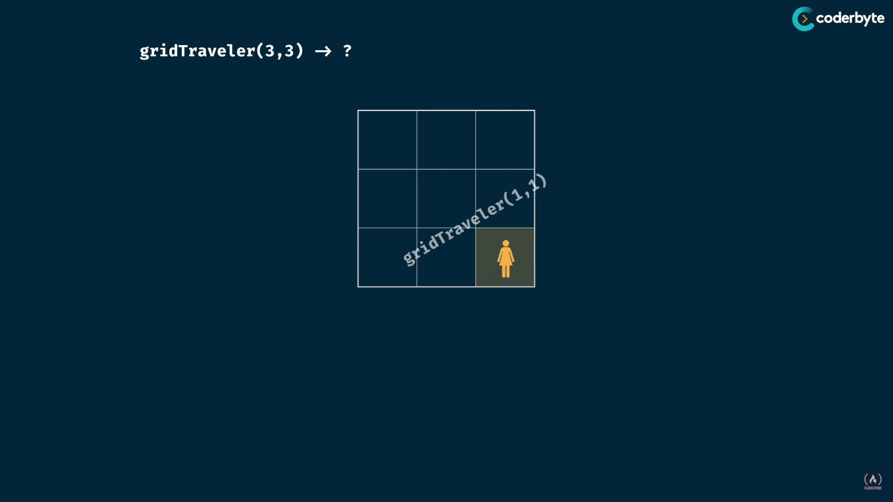
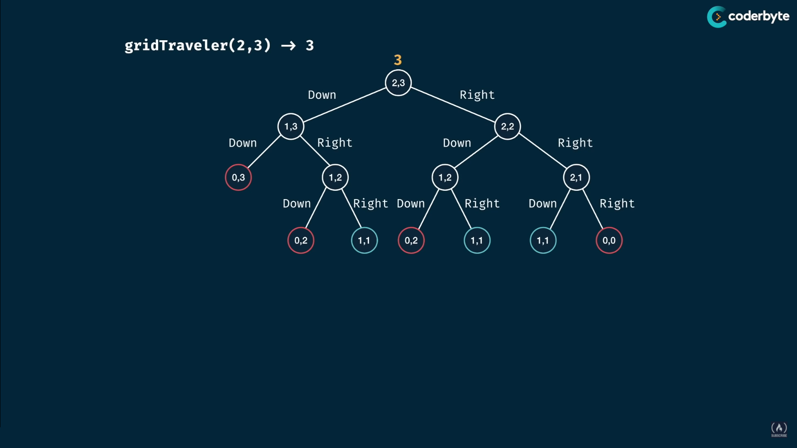          


A megoldás szinte azonos a n-edik fibonacci száméval, 

```cs
using System;

long GridTraveler (long n, long m) {
    if (n == 1 && m == 1) return 1; //ha célba értünk +1 lehetséges mód
    if (n == 0 || m == 0) return 0; //ha kijöttünk a táblából, onnantól 0 féle képpen érhetünk célba
    return GridTraveler(n - 1, m) + GridTraveler(n, m - 1);
}

Console.WriteLine(GridTraveler(1, 1)); // 1
Console.WriteLine(GridTraveler(2, 3)); // 3
Console.WriteLine(GridTraveler(3, 2)); // 3
Console.WriteLine(GridTraveler(3, 3)); // 6
Console.WriteLine(GridTraveler(4, 5)); // 35
Console.WriteLine(GridTraveler(5, 4)); // 35
Console.WriteLine(GridTraveler(18, 18)); // (...)
```

Azonban a Fibonacci-hoz hasonlóan itt is eljutunk arra a pontra, ahol a nagy fa mélység miatt a programunk kicsit meghal.
A képen is látható, hogy az `1,2` `1,2` `2,1` ágakat feleslegesen számoljuk ki újra és újra.
(`1*2` = `2*1`, mivel egy `n*m`-es grid-en ugyanannyi lehetőség van mint egy `m*n`-esen)

Hogyan tudnánk ezeket a problémákat kiküszöbölni?

## Dinamikus programozás

A dynamic programming a megoldás a sok azonos hívás elkerülésére. Nem kell tőle megijedni, egyszerűbb mint gondolnád.

A rekurzív algoritmusok sokszor azért lassúak, mert bizonyos részproblémákat többször is kiszámolnak.
Tipikusan ez történik, amikor optimalizálási feladatunk van és a megoldáskezdeményeket lepésről lépésre
építjük fel.

Ezt úgy tudjuk elkerülni, ha az egyszer már kiszámolt részmegoldásokat eltároljuk, és később
újra felhasználjuk azokat. A több időt valójában most több tárra „cseréljük”, melynek eredményeként a
rekurzív programok időkomplexitása drasztikusan csökkenthető.

A dinamikus programozás a részproblémákra bontás gyengeségeit két fő módszerrel próbálja orvosolni:
- Az egyik módszer lényege, hogy programunk futása alatt a megoldott részproblémák (optimális)
megoldását eltároljuk, majd ha ugyanezen részprobléma megoldására szükségünk lenne később,
csak kiolvassuk a megoldást, nem oldjuk meg új a részfeladatot. (TÁBLÁZATKITÖLTÉS módszere)
- Általában amikor a részproblémákat többször is szükséges meg oldani, akkor az összes lehetséges
„kis” részproblémát ki kell számolni, hogy az eredeti nagy probléma megoldása kiszámítható
legyen. Ezért a dinamikus programozásban tipikusan a legkisebb problémától indulunk, minden
egyes nagyobb részprobléma megoldását kiszámítjuk a kisebb részfeladatok megoldásainak
felhasználásával, egészen addig míg az eredeti/legnagyobb feladatig el nem jutunk (LENTRŐL
FELFELÉ ÉPÍTKEZÉS módszere). Vegyük észre, hogy ez ellentétes az oszd-meg-és-uralkodj
algoritmusok filozófiájával, ahol mindig az eredeti problémát bontjuk kisebb és kisebb
problémákra (FELÖLRŐL LEFELÉ ÉPÍTKEZÉS módszere)

Tehát a lényeg annyi, hogy amit már egyszer kiszámoltunk tároljuk el egy gyűjteményben, és amikor legközelebb meghívják a függvényt
azzal a bemenettel, ne menjünk végig a fán megint, hanem csak szedjük ki az előzőleg kiszámolt értéket a gyűjteményünkből.

Nézzük először a fibonaccit:

```cs
long Fib(long n, Dictionary<long, long> memo)
{
    if (memo.ContainsKey(n)) return memo[n];
    if (n <= 2) return 1;

    memo[n] = Fib(n - 1, memo) + Fib(n - 2, memo);
    return memo[n];
}

Console.WriteLine(Fib(40, new Dictionary<long, long>())); // 102334155
Console.WriteLine(Fib(90, new Dictionary<long, long>())); // 2880067194370816120
```

Itt annyi történik, hogy van kulcs-érték listánk (`memo`), és ha meghívásra kerül az első példából mondjuk a `Fib(4)`,
akkor miután kiszámoltuk az értékét, a memo-hoz egy új kulcs-érték párt adunk hozzá, ahol a kulcs 4 lesz (`n`),
az érték pedig a kiszámolt 3. Ha pedig már van ilyen kulcs a memo-ban, akkor visszaadjuk az értékét, tehát nem kell megint kiszámolni a `Fib(4)`-et.

Ezen az elv után így fog kinézni a tree:

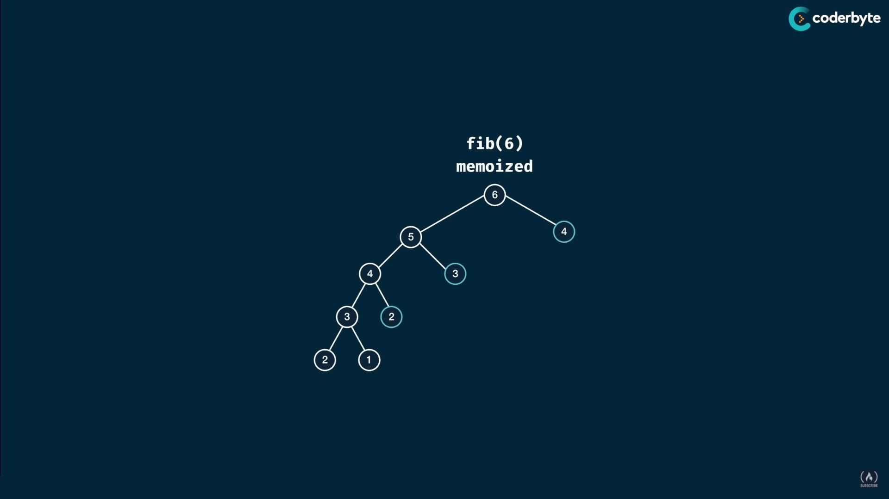

Látható, hogy amiket már egyszer kiszámoltunk 2, 3, 4, nem fogjuk újra, `if (memo.ContainsKey(n)) return memo[n];`,
hanem csak visszadjuk az értékét, ezzel drasztikusan lecsökkentve a hívások számát a call stack-en. <br>
Fentebbi kódban láthatod, hogy itt még a `Fib(90)`-et is gond nélkül kiszámoltuk!

A Grid Traveles feladatánl a megoldás ugyanez!!

```cs
long GridTraveler(long n, long m, Dictionary<string, long> memo)
{
    string key = n <= m ? n + ";" + m : m + ";" + n; // (2, 3) is the same as (3, 2)

    if (memo.ContainsKey(key)) return memo[key];
    if (n == 1 && m == 1) return 1;
    if (n == 0 || m == 0) return 0;

    memo[key] = GridTraveler(n - 1, m, memo) + GridTraveler(n, m - 1, memo);
    return memo[key];
}

Console.WriteLine(GridTraveler(1, 1, new Dictionary<string, long>())); // 1
Console.WriteLine(GridTraveler(5, 4, new Dictionary<string, long>())); // 35
Console.WriteLine(GridTraveler(18, 18, new Dictionary<string, long>())); // 2333606220
```

Ezt a technikát `memorizálásnak` hívják.

#### Memorizálás recept

1. Make it work
    - Vizualizáld a problémát egy fa-ként
    - Implementáld a fá rekurzióval
    - teszteld le
  

2. Optimalizáld
    - adj hozzá egy `memo` objektumot
    - adj a base case feltételt  `memo` érték visszaadására
    - tárold el a visszatért értékeket a `memo`-ban

### Tabulálás/Táblázatépítés

Másik gyakori dinamikus programozási technika a tabulálás, itt rekurzió, és fákkal ellentétben egy táblában képzeljük el a probléma megoldását.

Először nézzük meg ennék a recepjét:

- probléma vizualizálása táblaként
- méretezd a táblát az inputok alapján
- töltsd fel a táblát alap értékekkel
- ágyazd be a triviális értéket a táblába
- iterálj végig a táblán valami logika alapján
- töltsd ki a következő pozíciókat az aktuális pozíció alapján

A tabulálás nem más mint egy tábla felépítése iteratív módon.

#### Nézzük a fibonaccit

- a 0. száma a szekvenciának 0
- az 1. száma a szekvenciának 1
`fib(6) ->` egy 7 elemű tömb kell nekünk (mindig 1-gyel több)

```cs
long Fib(long n)
{
    long[] table = new long[n + 1];
    table[1] = 1;
    // n = 6
    // 0 1 0 0 0 0 0 

    // 0 1 1 0 0 0 0 
    // 0 1 1 2 0 0 0 
    // 0 1 1 2 3 0 0 
    // ...
    // 0 1 1 2 3 5 8
    for (long i = 2; i <= n; i++)
    {
        table[i] = table[i - 1] + table[i - 2];
    }

    return table[n];
}

Console.WriteLine(Fib(6)); //8
Console.WriteLine(Fib(40)); //102334155
Console.WriteLine(Fib(90)); //2880067194370816120
```

Mindenfelé rekurzió, és Dictionary nélkül már egy ciklussal kiszámítjuk a `Fib(90)`-et

De lehet így is:

```cs
using System;

long Fib(long n)
{
    long[] memo = new long[n + 1];
    memo[1] = 1;

    for (long i = 0; i <= n; i++)
    {
        if (i < n) { memo[i + 1] += memo[i]; }
        if (i < n - 1) { memo[i + 2] += memo[i]; }
    }

    return memo[n];
}

Console.WriteLine(Fib(6)); //8
Console.WriteLine(Fib(40)); // 102334155
Console.WriteLine(Fib(90)); // 2880067194370816120
```

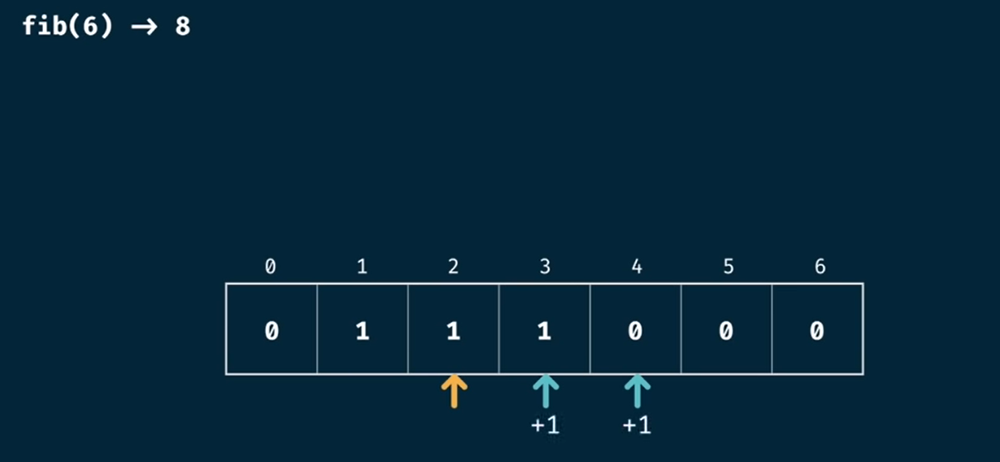
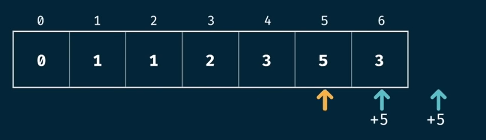

#### Grid Travel tabulation

| 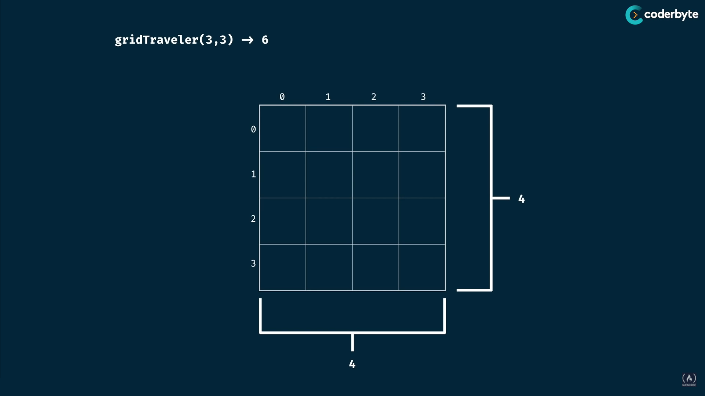 | 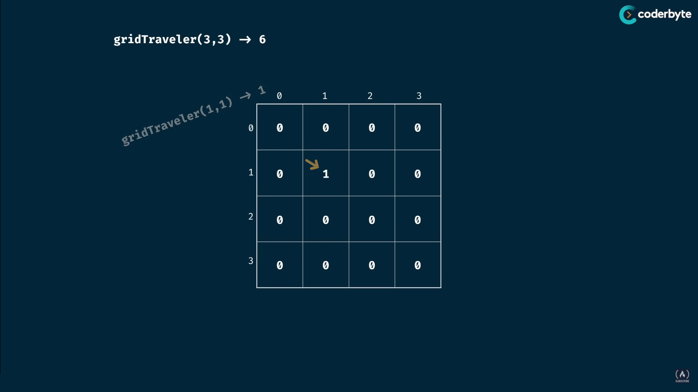
| ------------------------- | ----------------------------
| 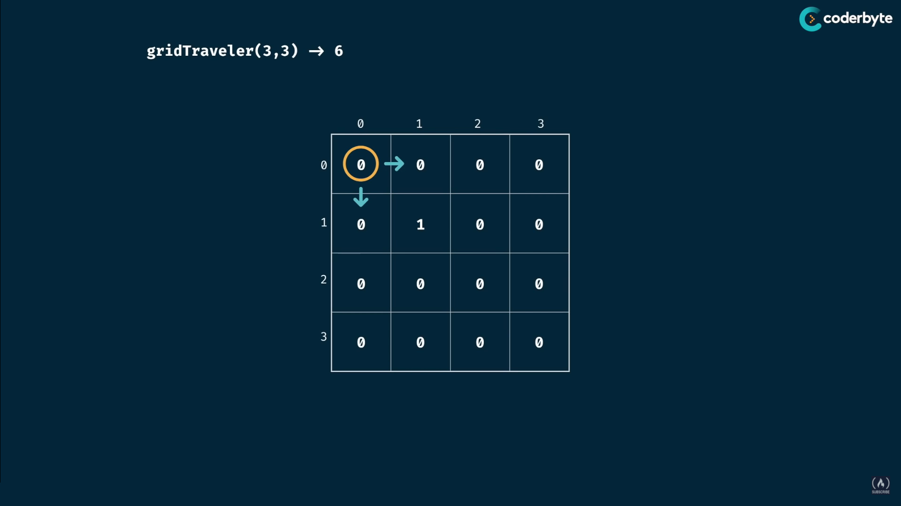 | 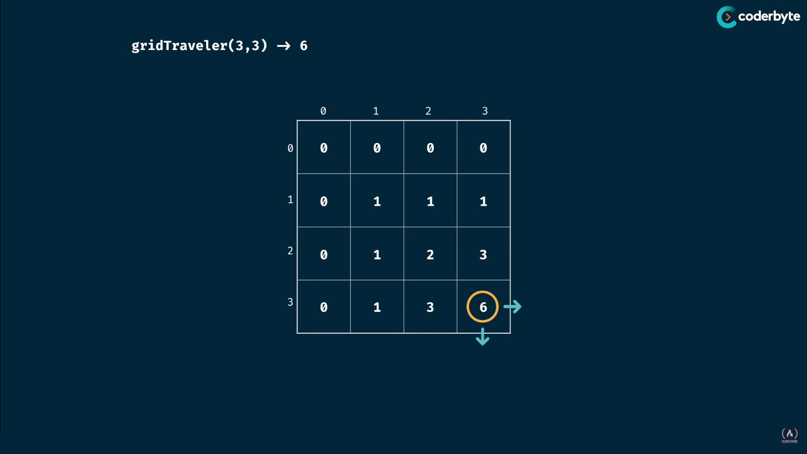

```cs
using System;

long GridTraveler(int n, int m)
{

    long[][] table = new long[n + 1][];
    for (int i = 0; i <= n; i++)
    {
        table[i] = new long[m + 1];
    }
    table[1][1] = 1;
    // n = 3; m = 3;
    // 0 0 0 0
    // 0 0 0 0
    // 0 0 0 0
    // 0 0 0 0

    for (int i = 1; i <= n; i++)
    {
        for (int j = 1; j <= m; j++)
        {
            if (i + 1 <= n) table[i + 1][j] += table[i][j];
            if (j + 1 <= m) table[i][j + 1] += table[i][j];
        }
    }
    // 0 0 0 0
    // 0 1 1 1
    // 0 1 2 3
    // 0 1 3 6
    return table[n][m]; // 6
}

Console.WriteLine(GridTraveler(1, 1)); // 1
Console.WriteLine(GridTraveler(2, 3)); // 3
Console.WriteLine(GridTraveler(3, 2)); // 3
Console.WriteLine(GridTraveler(3, 3)); // 6
Console.WriteLine(GridTraveler(4, 5)); // 35
Console.WriteLine(GridTraveler(5, 4)); // 35
Console.WriteLine(GridTraveler(18, 18)); // 2333606220
```

<br>

## Viszzalépéses keresés / backtracking

A visszalépéses keresés (`backtrack`) a problémamegoldás igen széles területén alkalmazható algoritmus, amelynek lényege a feladat megoldásának megközelítése `rendszeres próbálgatással`.
Néha ez a legjobb megoldás, mivel a visszalépéses keresés gyakran sokkal gyorsabb, mint az összes részmegoldásra alkalmazott kimerítő keresés (brute-force keresés), mivel egyetlen vizsgálattal sok részmegoldást ki tud zárni.

Adott N sorozat, amelyek rendre `M[1], M[2], ... M[N]` elemszámúak. Ki kell választani mindegyikből
egy-egy elemet úgy, hogy az egyes sorozatokból való választások másokat befolyásolnak.
Ez egy bonyolult keresési feladat, amelyben egy adott tulajdonsággal rendelkező szám N-est kell megadni úgy,
hogy ne kelljen az összes lehetőséget végignézni.

E feladatok közös jellemzője, hogy eredményük egy sorozat. E sorozat minden egyes tagját valamilyen sorozatból kell kikeresni, de az egyes keresések összefüggenek egymással (vezért nem lehet oda
tenni, ahol egy korábban letett vezér ütné; egy munkát nem lehet két munkásnak adni; ha egy pékségnek elfogyott a kenyere, akkor attól már nem lehet rendelni).
- A visszalépéses keresés olyan esetekben használható, amikor a keresési tér `fa `struktúraként
képzelhető el, amiben a gyökérből kiindulva egy csúcsot keresünk.
- Az algoritmus lényege, hogy a kezdőpontból kiindulva megtesz egy utat a feladatot részproblémákra bontva, és ha valahol az derül ki, hogy már nem juthat el a célig, akkor visszalép egy
korábbi döntési ponthoz, és ott más utat – más rész-problémát választ.
Először megpróbálunk az első sorozatból kiválasztani egy elemet, ezután a következőből, s ezt addig
csináljuk, amíg választás lehetséges.

### Vezérek

Az alap tankönyvi példa, amit te is majd elmesélsz vizsgán az `N` vezér probléma.

Helyezzünk el egy `N*N`-es sakktáblán N vezért úgy, hogy ne üssék egymást! Az összes lehetséges
megoldásból nagyon sok is lehet, de egyetlen megoldás megtalálása várhatóan sokkal gyorsabb.
Megjegyzés: sok olyan feladat van – például N elem összes lehetséges sorrendjének előállítása – ahol
az összes megoldás előállítására használjuk a visszalépéses keresés – pontosabban visszalépéses kiválogatás – algoritmusát, egyetlen megoldás keresésére azonban nincs rá szükség.

A vezérekről azt kell tudnunk, hogy a sorukban, az oszlopukban és az átlójukban álló bábukat üthetik.
Tehát úgy kell elhelyezni a vezéreket, hogy minden sorban és minden oszlopban is pontosan 1 vezér
legyen, és minden átlóban legfeljebb 1 vezér legyen!
Ebből következik, hogy a megoldásokban elég azt megmondani, hogy az 1. oszlopban levő vezér melyik sorban áll, a második oszlopban levő vezér melyik sorban áll, … és így tovább.


#### `N = 4`:

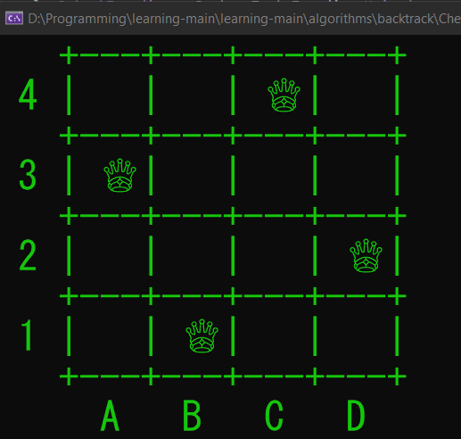

#### `N = 5`

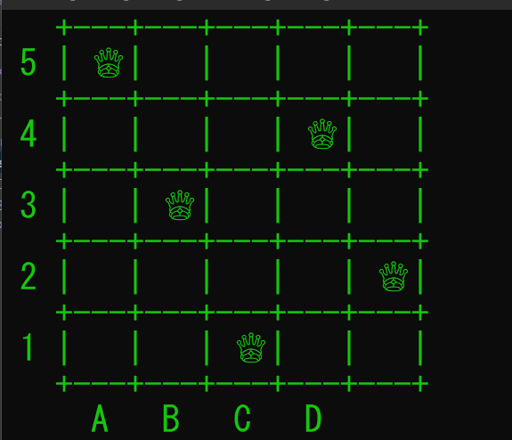

### **Egy programot is feltöltöttem a tételes mappába, kérlek töltsd le, és nyomkod végig (csak vizualizáció).**
Úgy könnyebb megérteni a backtrack működését!!!**

Az algoritmus:

```cs
// megnézzük, hogy az adott helyre rakhatunk-e vezért
bool CanPlace(int[][] board, int row, int rank)
{
    //row to the left
    for (int i = 0; i < rank; i++)
    {
        if (board[row][i] == 1) return false;
    }

    //lower left diagonal
    for (int i = row, j = rank; i >= 0 && j >= 0; i--, j--)
    {
        if (board[i][j] == 1) return false;
    }

    //upper left diagonal
    for (int i = row, j = rank; i < SIZE && j >= 0; i++, j--)
    {
        if (board[i][j] == 1) return false;
    }

    return true;
}

// rank az oszlop
bool Solve(int[][] board, int rank)
{
    //ha nagyobb oszlopot néznük, mint a tábla, akkor az összes vezért letettük. SIKER!
    if (rank >= SIZE) return true;
    //row a sor
    //végigmegyünk table[row][RANK] oszlopán, és megpróbáljuk valahova letenni a vezért
    for (int row = 0; row < SIZE; row++)
    {
        //ha van jó hely
        if (CanPlace(board, row, rank))
        {
            board[row][rank] = 1; //akkor letesszük a vezért
            if (Solve(board, rank + 1)) return true; //akkor előrelépünk a következő oszlopra (megyünk tovább az ágban)
            board[row][rank] = 0; //de ha abból nem születik megoldás, akkor kivesszük
            //(visszalépünk a fában, és egy új ágat kezdünk el vizsgálni)
        }
    }

    //ha ebben az oszlopban nincs valid hely, akkor az előző oszlopra lépünk vissza
    return false;
}
```

<br>

## Mohó algoritmus /Greedy algorithm

A mohó stratégia lényege röviden megfogalmazva:
minden döntési helyzetben válasszuk azt a döntést, ami
pillanatnyilag a legkedvezőbbnek tűnik.
Ez a stratégia persze nem mindig szerencsés, de a feladatok egy viszonylag széles körére alkalmazható.
A stratégia alapján egyértelmű, hogy olyan feladatok esetén merülhet fel egyáltalán az alkalmazása,
amikor több döntést kell hozni egymás után (lépésenként), és a döntés jóságát is meg kell fogalmazni valahogy (azaz minimum vagy maximum feltételt fogalmazunk meg).

Optimalizálási probléma megoldására szolgáló algoritmus sokszor olyan lépések sorozatából áll, ahol minden
lépésben adott halmazból választhatunk. Ezt gyakran dinamikus programozás alapján oldjuk meg, de előfordul, hogy
a dinamikus programozás túl sok esetet vizsgál annak érdekében, hogy az optimális választást meghatározza.
A mohó algoritmus mindig az adott lépésben optimálisnak látszó választást teszi. Vagyis, a lokális optimumot
választja abban a reményben, hogy ez globális optimumhoz fog majd vezetni.
Mohó algoritmus nem mindig ad optimális megoldást, azonban sok probléma megoldható mohó algoritmussal.

### Filmek

[Forrás](http://tehetseg.inf.elte.hu/szakkorefop2017/pdf/ELTE_IK_Szakkor_moh%C3%B31_20181101.pdf)

Egy kábelhálózat különböző csatornáin `N` filmet játszanak. Ismerjük mindegyik film kezdési és
végidejét. Egyszerre csak 1 filmet tudunk nézni. Add meg, hogy maximum hány filmet nézhetünk
végig és melyeket!

**Megoldás**: A megoldás egy N elemű halmaz legnagyobb, adott tulajdonsággal rendelkező részhalmazának kiválasztása (a legtöbb film, amelyek egyike sem fedi át a másikat).

**Probléma**: egy N elemű halmaznak `2^N` részhalmaza van.

**Futási idő**: `O(2^N)` (ezt már ismerjük)

**Ötlet**: Rendezzük sorba a filmeket befejezési idejük szerint növekvő sorrendbe!

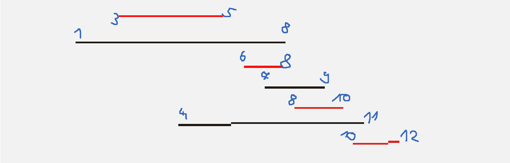

Ha a leghamarabb befejeződőt választjuk, akkor lesz a legtöbb lehetőségünk a többi közül választani.

```cs
class Film
{
    public int Id { get; set; }
    public int Kezd { get; set; }
    public int Veg { get; set; }
    public Film(int id, int kezd, int veg)
    {
        Id = id;
        Kezd = kezd;
        Veg = veg;
    }

    public override string ToString()
    {
        return $"id: {Id}, Kezd: {Kezd}, Veg: {Veg}";
    }
}

class Program
{
    static void Rendezes(ref List<Film> filmek)
        => filmek = filmek.OrderBy(x => x.Veg).ToList();
        
    static void Kivalogat(List<Film> filmek)
    {
        List<Film> result = new List<Film>();
        result.Add(filmek[0]);
        Film current = result[0];

        for (int i = 1; i < filmek.Count; i++)
        {
            if (filmek[i].Kezd >= current.Veg)
            {
                result.Add(filmek[i]);
                current = filmek[i];
            }
        }

        Console.WriteLine("A legtöbb film amit megnézhetünk: " + result.Count);
        result.ForEach(x => Console.WriteLine(x));
    }

    static void Main()
    {
        List<Film> filmek = new List<Film>();
        filmek.Add(new Film(1, 10, 12)); //id, kezd, veg
        filmek.Add(new Film(2, 6, 8));
        filmek.Add(new Film(3, 11, 11));
        filmek.Add(new Film(4, 8, 10));
        filmek.Add(new Film(5, 1, 8));
        filmek.Add(new Film(6, 3, 5));
        filmek.Add(new Film(7, 7, 9));
        
        Rendezes(ref filmek);
        Kivalogat(filmek);
    }
}
```

<br>

## Oszd meg és uralkodj

Egyik legfontosabb, sokféleképpen alkalmazható elvünk az ókori latin kultúrából ránk maradt
oszd meg és uralkodj elve alapján fogalmazható meg: oszd részekre, majd a részek független megoldásával az egész feladatot könnyebben oldhatod meg. Így programod könnyen kézben tarthatod,
vagyis uralkodhatsz felette.
Ezt a stratégiai elvet tartjuk szem előtt akkor, amikor gondolkodásmódunkat kívánjuk helyes
mederbe terelni. Lépésenkénti finomításnak nevezik ezt az elvet a feladatmegoldás filozófiájában. A
feladatot néhány (=nem túl sok!) részfeladatra bontjuk. Úgy is mondhatnánk: a feladatot megoldjuk a legfelső szinten. Ezt az eljárást fogjuk követni az egyes részfeladatok megoldásakor is (a részek feletti uralkodás érdekében), mindaddig, amíg a részfeladatok elemi utasításokkal megoldhatóvá
válnak.

A stratégia lépései:

- felosztás (megadjuk a részfeladatokat, amikre a feladat lebontható)
- uralkodás (rekurzívan megoldjuk az egyes részfeladatokat)
- összevonás (az egyes részfeladatok megoldásából előállítjuk az eredeti feladat megoldását)

Az ilyen feladatok megoldását természetéből adódóan rekurzívan fogalmazzuk meg. A rekurzív
eljárás – mint a rekurzió minden esetben – kétféle részből kell álljon:

- a triviális esetből (amikor nincs rekurzív hívás), megadva ennek megoldását,
- az általános esetből, amikor rekurzívan visszavezetjük kisebb problémák megoldására
(sokszor kettőre, de néha többre is).

Ezek alapján a következőképpen fogunk gondolkodni:

- Mi az általános feladat alakja? Mik a paraméterei? Ebből kapjuk meg a rekurzív eljárásunk
specifikációját.
- Milyen paraméterértékekre kapjuk a konkrét feladatot? Ezekre fogjuk meghívni kezdetben
az eljárást!
- Mi a leállás (triviális eset) feltétele? Hogyan oldható meg ilyenkor a feladat?
- Hogyan vezethető vissza a feladat hasonló, de egyszerűbb részfeladatokra? Hány részfeladatra vezethető vissza?
- Melyek ilyenkor az általános feladat részfeladatainak a paraméterei? Ezekkel kell majd
meghívni a rekurzív eljárást!
- Hogyan építhető fel a részfeladatok megoldásaiból az általános feladat megoldása?

### Logaritmikus keresés / Binary search

Ezt a problémát már említettem a rekurzió és a `O(log n)` kapcsán, de most nézzük meg mélyebben:

Adott egy rendezett sorozat, amelyben egy adott értékű elem sorszámát kell
meghatározni, ha az benne van a sorozatban.
A rendezettséget és az indexelhetőséget kihasználhatjuk. Vizsgáljuk meg első lépésben a sorozat középső elemét! Ha ez a keresett elem, akkor készen vagyunk. Ha a keresett elem ennél kisebb, akkor
csak az ezt megelőzőek között lehet, tehát a keresést a továbbiakban a sorozatnak arra a részére
kell alkalmazni. Ha a keresett ennél nagyobb, akkor pedig ugyanezen elv alapján a sorozat ezt követő részére.

```cs
// C# implementation of recursive Binary Search
using System;
 
class GFG {
    // Returns index of x if it is present in
    // arr[l..r], else return -1
    static int binarySearch(int[] arr, int l, int r, int x)
    {
        if (r >= l) {
            int mid = l + (r - l) / 2;
 
            // If the element is present at the
            // middle itself
            if (arr[mid] == x)
                return mid;
 
            // If element is smaller than mid, then
            // it can only be present in left subarray
            if (arr[mid] > x)
                return binarySearch(arr, l, mid - 1, x);
 
            // Else the element can only be present
            // in right subarray
            return binarySearch(arr, mid + 1, r, x);
        }
 
        // We reach here when element is not present
        // in array
        return -1;
    }
 
    // Driver method to test above
    public static void Main()
    {
 
        int[] arr = { 2, 3, 4, 10, 40 };
        int n = arr.Length;
        int x = 10;
 
        int result = binarySearch(arr, 0, n - 1, x);
 
        if (result == -1)
            Console.WriteLine("Element not present");
        else
            Console.WriteLine("Element found at index "
                              + result);
    }
}
```

Binary Search úgy működik, hogy van egy rendezett listánk, és keresünk benne egy elemet.
Mivel rendezett, ezért megnézzük, hogy a középen levő elem nagyobb vagy kisebb-e a keresett értéknél.
Ha nagyobb, akkor a tömbnek a felét már nem is szükséges megnézni.

Másik példa:

Gondoltam egy száma 1 és 100 között, melyik az? (19)

- 50-nél nagyobb vagy kisebb?
- 25-nél nagyobb vagy kisebb?
- 17-nél nagyobb vagy kisebb?
- 21-nél nagyobb vagy kisebb?
- 19 Boom

```cs
N = 100
Operations = 4
```

Gondoltam egy száma 1 és 200 között, melyik az? (19)

- 100-nél nagyobb vagy kisebb?
- 50-nél nagyobb vagy kisebb?
- 25-nél nagyobb vagy kisebb?
- 17-nél nagyobb vagy kisebb?
- 21-nél nagyobb vagy kisebb?
- 19 Boom

```cs
N = 200
Operations = 5
```

A második játéknál hiába lett 2x annyi szám, csak 1-el több kérdésbe kerül nekem, hogy eljussak oda mint az előbb.

Ez a `O(log n)` ereje.

### Összefésüléses rendezés (mergesort) `O(nlogn) in worst case`

Az egyik legszebb példa oszt meg és uralkodj ra, Neumann János találta fel 1945-ben.

Ha van két rendezett sorozatunk, akkor abból az összefésülés algoritmusa gyorsan elő tudja állítani a két sorozat elemeit tartalmazó rendezett sorozatot:

 

```java
public class Main{
    public static void main(String[] args) {
        int[] data = new int[] {38, 27, 43, 3, 9, 82, 10};
        mergeSort(data, 0, data.length-1);
        
        for (int i = 0; i < data.length - 1; i++) {
            System.out.print(data[i] + " ");
        }
    }

    public static void mergeSort(int[] data, int start, int end) {
        if (start < end) {
            int mid = (start + end) / 2;
            mergeSort(data, start, mid);
            mergeSort(data, mid+1, end);
            merge(data, start, mid, end);
        }
    }

    public static void merge(int[] data, int start, int mid, int end) {
        // build temp array to avoid modifying the original contents
        int[] temp = new int[end - start + 1];

        int i = start, j = mid + 1, k = 0;

        // While both sub-array have values, then try and merge them in sorted order
        while ( i <= mid && j <= end) {
            if ( data[i] <= data[j]) {
                temp[k++] = data[i++];
            }
            else {
                temp[k++] = data[j++];
            }
        }

        // Add the rest of the values from the lest sub-array into the result
        while (i <= mid) {
            temp[k++] = data[i++];
        }
        while (j <= end) {
            temp[k++] = data[j++];
        }

        for (i = start; i <= end; i++) {
            data[i] = temp[i-start];
        }
    }
}
```

<br>

## Zárszó.: Dinamkus vs Visszalépéses vs Mohó

Mi a különbség a 3 feladatmegoldási stratégia között?

1. **Mohó megközelítés**

Rögzített politikát követ a cél (a kijutás a labirintusból) felé haladva:
Minden kereszteződésnél a legszélesebb útvonalat választom (négy sávos kereszteződést feltételezve),
amíg el nem érem a kivezető nyílást, és soha nem megyek vissza egyetlen kereszteződésbe sem.
Ezzel vagy megtaláljuk a kivezető nyílást vagy sem. Most miért a legszélesebb útvonal? Mert kapzsi vagyok,
és ezért mindig a legjobbat választom a rendelkezésre álló lehetőségek közül.
És az én definícióm a legjobbra a legtágabb (ez különböző embereknél eltérő lehet).

Ezzel a megközelítéssel lehet, hogy sikerül kijutnom, de lehet, hogy nem, de legalább gyorsan végzek a kereséssel.

2. **Visszalépéses keresés**

Itt véletlenszerűen anélkül, hogy 'gondolkodnék', minden kereszteződésnél kiválasztok egyet a négy sáv közül,
és haladok előre. Ennek során, ha zsákutcába ütközöm, visszakanyarodok a közvetlenül az előző kereszteződéshez,
és a fennmaradó lehetőségek közül választok (1. vagy 3. vagy 4. sáv). És újra elkezdem az utamat a kijárat felé.
Ezt a folyamatot rekurzívan ismétlem, amíg sikerül kilépnem.

Ezzel a megközelítéssel minden bizonnyal megoldom a problémát, pl. Sikerül kijutnom. Viszont a befejezéshez szükséges idő lehet,
hogy a mohó megközelítésnél hosszabb lesz, de legalább sikerülni fog.

Használjuk ezt a technikát, ha tudjuk, hogy a problémára csak egy megoldás van.

3. **Dinamikus programozás**

Ebben a megközelítésben az összes lehetséges útvonalat kipróbálom, és kiválasztom a legjobbat.
Ha egy útvonal bejárása közben zsákutcába ütközöm, akkor kidobom az útvonalat, és visszamegyek a rejtvény elejére, azaz az első kereszteződéshez,
és nem a közvetlen előző keresztezéshez (ahogyan a backtrack megközelítésben azt teszem).

Ezzel a megközelítéssel nem csak megoldom a problémát, hanem felfedezem a legjobb (optimális) útvonalat
(ha az általános labirintus probléma adott esetben egynél több ilyen útvonal létezik) és igen, az általam fizetett költség ez a plusz idő,
amibe kerül, mert nem csak a megoldás érdekel, hanem a legjobb (optimális) megoldás is érdekel.

Ezt a megközelítést akkor érdemes alkalmazni, ha ismert vagy érezhető, hogy a feladványra több válasz is lehet.

<br>

## Kiválogatás, Maximum kiválasztás

Ezekről nem tudom mit mondjak, ez megalázóan könnyű.

Elsőnél végigmész egy gyűjteményen, és amelyik elemre teljesül egy feltétel, azt kiírod, vagy belerakod valahova.

Másiknál is végigmész a tömbbön, és amelyik elem nagyobb mint az aktuális maximum azt beállítod az aktuális maximumra.

<br>
<br>
<br>
