# Dynamic Programming

<br>

## **Main references:**

### https://www.youtube.com/watch?v=oBt53YbR9Kk
### https://coderbyte.com/

<br>

## Fibonacci

### Brute Force Solution

```cs
using System;

long Fib (long n) {
    if (n <= 2) return 1;
    return Fib(n-1) + Fib(n-2);
}

Console.WriteLine(Fib(40)); // 102334155
Console.WriteLine(Fib(50)); // (...) 
```

#### Complexity Brute Force: Exponential

`O(2^n) time` <br>
`O(n) space `

### Dynamic Programming Solution - Memoization

| 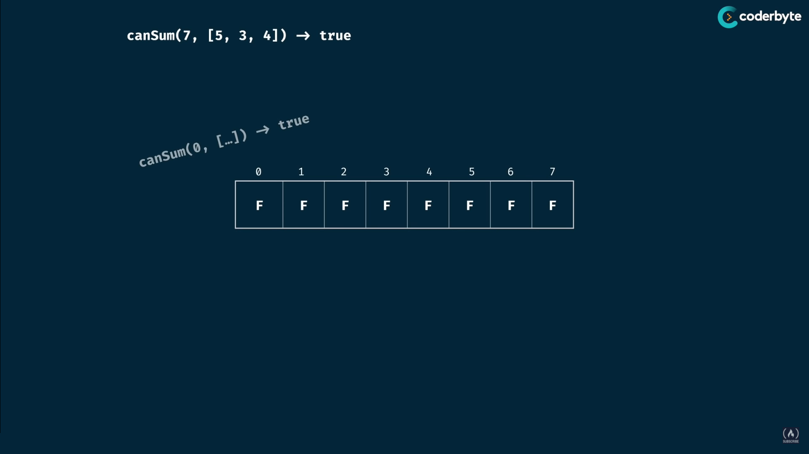 | 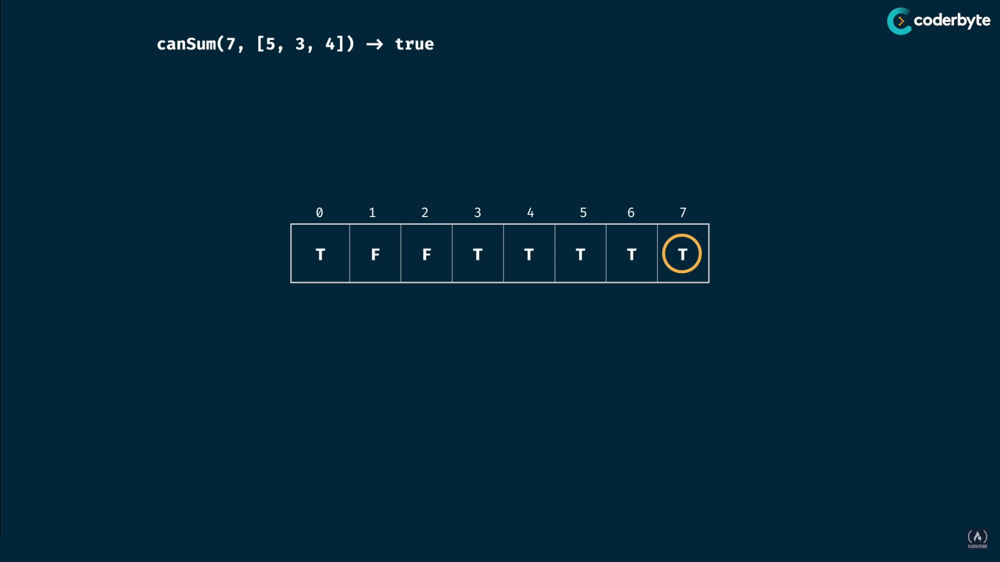
| -------------- | --------------
| 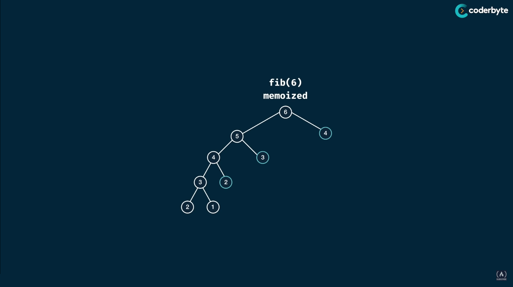 |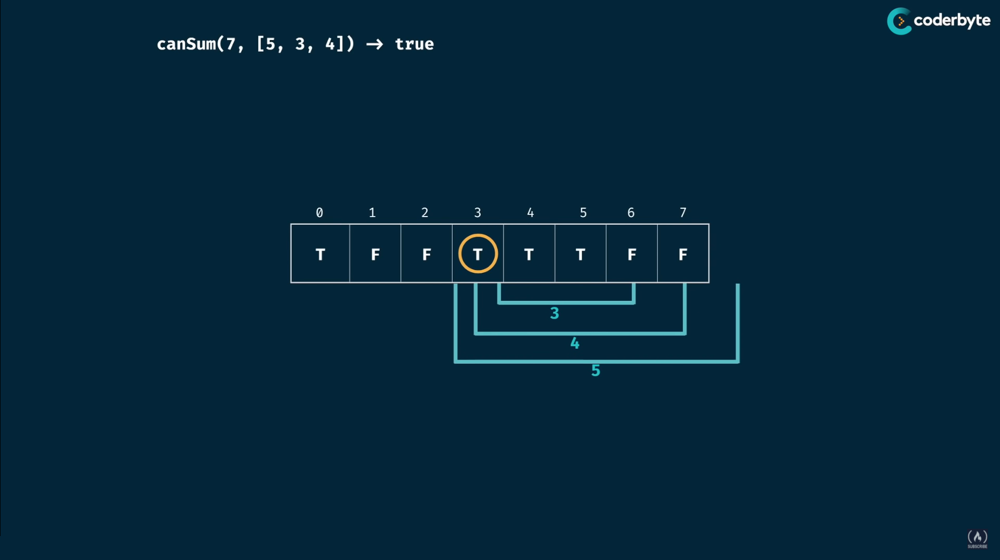

```cs
using System;
using System.Collections.Generic;

long Fib (long n, Dictionary<long, long> memo) {
    if (memo.ContainsKey(n)) return memo[n];
    if (n <= 2) return 1;

    memo[n] = Fib(n-1, memo) + Fib(n-2, memo);
    return memo[n];
}

Console.WriteLine(Fib(40, new Dictionary<long, long>())); // 102334155
Console.WriteLine(Fib(90, new Dictionary<long, long>())); // 2880067194370816120
```

#### Complexity DP: Linear

`O(n) time` <br>
`O(n) space`


<br>

## Grid Traveler Problem

You are a traveler on a 2D grid. You begin in the top-left corner and your goal is to travel to the bottom-right corner. You may only move down or right.

How many ways can you travel to the goal on a grid with dimensions `m * n`?

|  | 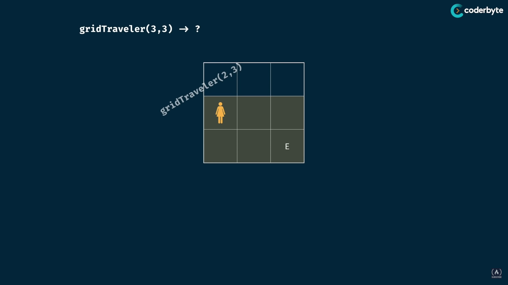
| ------------------------- | ----------------------------
| 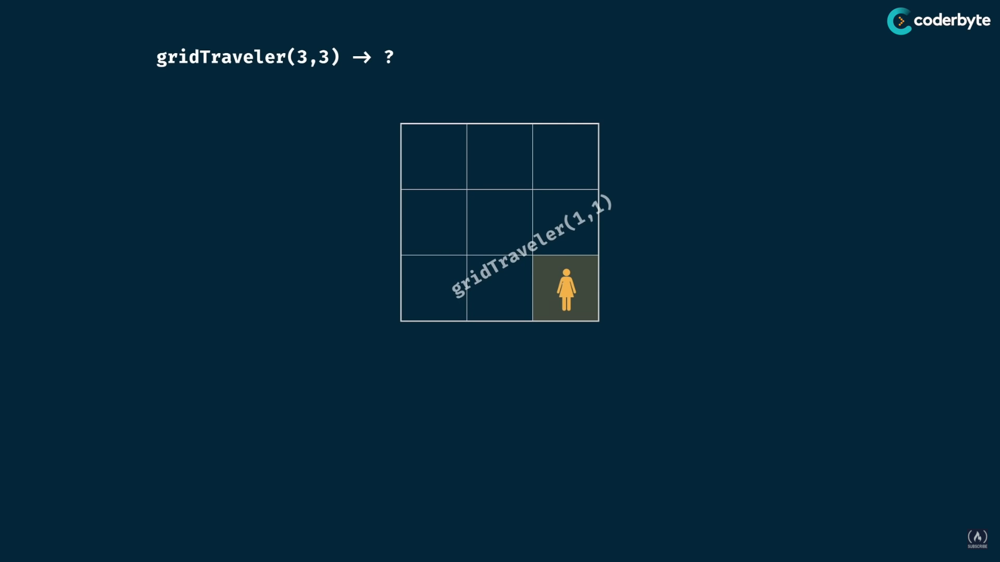 | 

### Brute Force Solution

```cs
using System;

long GridTraveler (long n, long m) {
    if (n == 1 && m == 1) return 1;
    if (n == 0 || m == 0) return 0;
    return GridTraveler(n - 1, m) + GridTraveler(n, m - 1);
}

Console.WriteLine(GridTraveler(1, 1)); // 1
Console.WriteLine(GridTraveler(2, 3)); // 3
Console.WriteLine(GridTraveler(3, 2)); // 3
Console.WriteLine(GridTraveler(3, 3)); // 6
Console.WriteLine(GridTraveler(4, 5)); // 35
Console.WriteLine(GridTraveler(5, 4)); // 35
Console.WriteLine(GridTraveler(18, 18)); // (...)
```

#### Complexity Brute Force: Exponential

`O(2^(n+m)) time` <br>
`O(n+m) space`

### Dynamic Programming Solution - Memoization

```cs
using System;
using System.Collections.Generic;

long GridTraveler (long n, long m, Dictionary<string, long> memo) {
    string key = n <= m ? n + ";" + m : m + ";" + n; // (2, 3) is the same as (3, 2)

    if (memo.ContainsKey(key)) return memo[key];
    if (n == 1 && m == 1) return 1;
    if (n == 0 || m == 0) return 0;

    memo[key] = GridTraveler(n - 1, m, memo) + GridTraveler(n, m - 1, memo);
    return memo[key];
}

Console.WriteLine(GridTraveler(1, 1, new Dictionary<string, long>())); // 1
Console.WriteLine(GridTraveler(5, 4, new Dictionary<string, long>())); // 35
Console.WriteLine(GridTraveler(18, 18, new Dictionary<string, long>())); // 2333606220
```

#### Complexity DP: n * m or multi linear

`O(n*m) time` <br>
`O(n+m) space`

<br>

## Memoization Recipe

- **1. Make it work**
    * visualize the problem as a tree
    * implement the tree using recursion
    * test it


- **2. Make it efficient.**
    * add a memo object
    * add a base case to return memo values
    * store return values into the memo    

<br>
<br>

# Sum problems - Memoization

|  | 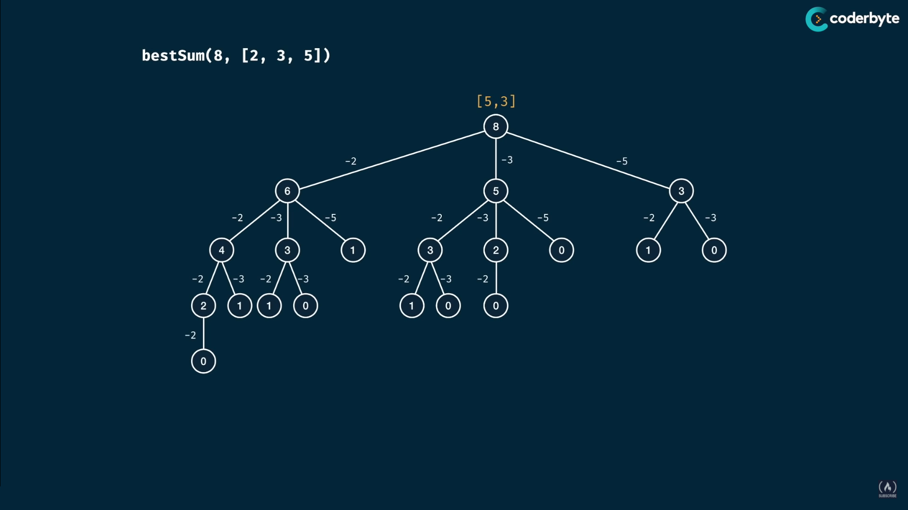
| --------------------------- | ----------------------
## CanSum

Write a function `CanSum(targetSum, numbers)` that takes in a targetSum and an array of numbers as arguments.

The function should return a boolean indicating whether or not it is possible to generate the targetSum using numbers from the array.

- You may use an element of the array as many times as needed.
- You may assume that all input members are nonnegative.

`CanSum(7, [5, 3, 4, 7]) -> true // 3 + 4 = 7 or simply 7` <br>
`CanSum(7, [2, 4]) -> false`

### Brute Force Solution

```cs
using System;
using System.Collections.Generic;

bool CanSum (int targetSum, List<int> numbers) {
    if (targetSum == 0) return true;
    if (targetSum < 0) return false;

    foreach (int num in numbers) {
        int diff = targetSum - num;
        if (CanSum(diff, numbers)) {
            return true;
        }
    }

    return false;
}

Console.WriteLine(CanSum(7, new List<int>() {2, 3})); // True
Console.WriteLine(CanSum(7, new List<int>() {5, 3, 4, 7})); // True
Console.WriteLine(CanSum(7, new List<int>() {2, 4})); // False
Console.WriteLine(CanSum(8, new List<int>() {2, 3, 5})); // True
Console.WriteLine(CanSum(300, new List<int>() {7, 14})); // (...)
```

#### Complexity Brute Force: n^m (I'm not sure it it's called Exponential)

`m = targetSum` <br>
`n = array length` <br>
`O(n^m) time` <br>
`O(m) space`

### Dynamic Programming Solution - Memoization

```cs
using System;
using System.Collections.Generic;

bool CanSum (int targetSum, List<int> numbers, Dictionary<int, bool> memo) {
    if (targetSum == 0) return true;
    if (targetSum < 0) return false;
    if (memo.ContainsKey(targetSum)) return memo[targetSum];

    foreach (int num in numbers) {
        int diff = targetSum - num;
        if (CanSum(diff, numbers, memo)) {
            memo.Add(targetSum, true);
            return true;
        }
    }

    memo.Add(targetSum, false);
    return memo[targetSum];
}

Dictionary<int, bool> NewDt () => new Dictionary<int, bool>();
Action<bool> cw = System.Console.WriteLine;
cw(CanSum(7, new List<int>() {2, 3}, NewDt())); // True
cw(CanSum(7, new List<int>() {5, 3, 4, 7}, NewDt())); // True
cw(CanSum(7, new List<int>() {2, 4}, NewDt())); // False
cw(CanSum(8, new List<int>() {2, 3, 5}, NewDt())); // True
cw(CanSum(300, new List<int>() {7, 14}, NewDt())); // False
```

#### Complexity DP: n * m

`m = targetSum` <br>
`n = array length` <br>
`O(n*m) time` <br>
`O(m) space`

<br>

## HowSum

Write a function `HowSum(targetSum, numbers)` that takes in a targetSum and an array of numbers as arguments.

The function should return an array containing any combination of elements that add up to exactly the targetSum. If there is no combination that adds up to the targetSum, then return `null`.

- If there are multiple combinations possible, you may return any single one.

### Brute Force Solution

```cs
using System;
using System.Collections.Generic;

void print(List<int> list) {
    if (list != null) {
        Console.WriteLine("[" + string.Join(", ", list) + "]");
    }
    else Console.WriteLine("null");
}

List<int> HowSum (int targetSum, List<int> numbers) {
    if (targetSum == 0) return new List<int>();
    if (targetSum < 0) return null;

    foreach (int num in numbers) {
        int diff = targetSum - num;
        List<int> temp = HowSum(diff, numbers);
        if (temp != null) {
            temp.Add(num);
            return temp;
        }
    }

    return null;
}

print(HowSum(7, new List<int>() {2, 3})); // [3, 2, 2,]
print(HowSum(7, new List<int>() {5, 3, 4, 7})); // [4, 3]
print(HowSum(7, new List<int>() {2, 4})); // null
print(HowSum(8, new List<int>() {2, 3, 5})); // [2, 2, 2, 2]
print(HowSum(300, new List<int>() {7, 14})); // (...)
```

#### Complexity Brute Force: n^m * m (Exponential maybe)

`m = targetSum` <br>
`n = array length` <br>
`O(n^m * m) time` <br>
`O(m) space`

### Dynamic Programming Solution - Memoization

```cs
using System;
using System.Collections.Generic;

void print(List<int> list) {
    if (list != null) {
        Console.WriteLine("[" + string.Join(", ", list) + "]");
    }
    else Console.WriteLine("null");
}

List<int> HowSum (int targetSum, List<int> numbers, Dictionary<int, List<int> > memo) {
    if (memo.ContainsKey(targetSum)) return memo[targetSum];
    if (targetSum == 0) return new List<int>();
    if (targetSum < 0) return null;

    foreach (int num in numbers) {
        int diff = targetSum - num;
        List<int> temp = HowSum(diff, numbers, memo);
        if (temp != null) {
            temp.Add(num);
            memo.Add(targetSum, temp);
            return temp;
        }
    }

    memo.Add(targetSum, null);
    return memo[targetSum];
}

Dictionary<int, List<int> > newMemo() => new Dictionary<int, List<int> >();
print(HowSum(7, new List<int>() {2, 3}, newMemo())); // [3, 2, 2,]
print(HowSum(7, new List<int>() {5, 3, 4, 7}, newMemo())); // [4, 3]
print(HowSum(7, new List<int>() {2, 4}, newMemo())); // null
print(HowSum(8, new List<int>() {2, 3, 5}, newMemo())); // [2, 2, 2, 2]
print(HowSum(300, new List<int>() {7, 14}, newMemo())); // null
```

#### Complexity DP: n * m^2

`m = targetSum` <br>
`n = array length` <br>
`O(n * m^2) time` <br>
`O(m^2) space`

<br>

## BestSum

Write a function `BestSum(targetSum, numbers)` that takes in a targetSum and an array of numbers as arguments.

The function should return an array containing the shortest combination of numbers that add up to exactly the targetSum.

- If there is a tie for the shortest combination, you may return any one of the shortest.

### Brute Force Solution

```cs
using System;
using System.Collections.Generic;

void print(List<int> list) {
    if (list != null) {
        Console.WriteLine("[" + string.Join(", ", list) + "]");
    }
    else Console.WriteLine("null");
}

List<int> BestSum (int targetSum, List<int> numbers) {
    if (targetSum == 0) return new List<int>();
    if (targetSum < 0) return null;

    List<int> min = null;
    foreach (int num in numbers) {
        int diff = targetSum - num;
        List<int> temp = BestSum(diff, numbers);
        if (temp != null) {
            temp.Add(num);
            if (min == null || temp.Count < min.Count) {
                min = temp;
            }
        }  
    }

    return min;
}

print(BestSum(7, new List<int>() {5, 3, 4, 7})); // [7]
print(BestSum(8, new List<int>() {2, 3, 5})); // [3, 5]
print(BestSum(8, new List<int>() {1, 4, 5})); // [4, 4]
print(BestSum(8, new List<int>() {3, 3})); // null
print(BestSum(100, new List<int>() {1, 2, 5, 25})); // (...)
```

#### Complexity Brute Force: n^m * m (Exponential maybe)

`m = targetSum` <br>
`n = array length` <br>
`O(n^m * m) time` <br>
`O(m) space`

<br>

### Dynamic Programming Solution - Memoization

```cs
using System;
using System.Collections.Generic;

void print(List<int> list) {
    if (list != null) {
        Console.WriteLine("[" + string.Join(", ", list) + "]");
    }
    else Console.WriteLine("null");
}

List<int> BestSum (int targetSum, List<int> numbers, Dictionary<int, List<int> > memo) {
    if (memo.ContainsKey(targetSum)) return memo[targetSum];
    if (targetSum == 0) return new List<int>();
    if (targetSum < 0) return null;

    List<int> min = null;
    foreach (int num in numbers) {
        int diff = targetSum - num;
        List<int> temp = BestSum(diff, numbers, memo);
        if (temp != null) {
            List<int> list = new List<int>(); // this one is tricky not gonna lie
            list.Add(num);
            list.AddRange(temp);
            if (min == null || temp.Count < list.Count) {
                min = list;
            }
        }  
    }

    memo.Add(targetSum, min);
    return min;
}

Dictionary<int, List<int> > newMemo() => new Dictionary<int, List<int>>();
print(BestSum(7, new List<int>() {5, 3, 4, 7},  newMemo())); // [7]
print(BestSum(8, new List<int>() {2, 3, 5}, newMemo())); // [3, 5]
print(BestSum(8, new List<int>() {1, 4, 5}, newMemo())); // [4, 4]
print(BestSum(8, new List<int>() {3, 3}, newMemo())); // null
print(BestSum(100, new List<int>() {1, 2, 5, 25}, newMemo())); // [25, 25, 25, 25]
```

#### Complexity DP:

`m = targetSum` <br>
`n = array length` <br>
`O(m^2 * n) time` <br>
`O(m^2) space`

<br>
<br>

# Construct problems

| 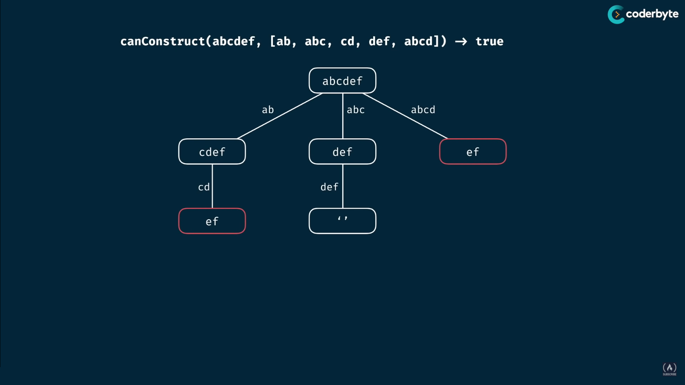 | 
| ------------------------- | --------------------------


## CanConstruct

Write a function `CanConstruct(target, wordBank)` that accepts a target string and an array of strings.

The function should return boolean indicating whether or not the `target` can be constructed by concatenating elements of the `wordBank` array.
We may reuse elements of `wordBank` as many times as needed.

### Straight to DP Solution

```cs
using System;
using System.Collections.Generic;

bool CanConstruct(string target, string[] wordBank, Dictionary<string, bool> memo)
{
    if (memo.ContainsKey(target)) { return memo[target]; }
    if (target == "") { return true; }

    foreach (string word in wordBank)
    {
        if (target.IndexOf(word) == 0)
        {
            string suffix = target.Substring(word.Length);
            if (CanConstruct(suffix, wordBank, memo))
            {
                memo[target] = true;
                return true;
            }
        }
    }

    memo[target] = false;
    return false;
}

Dictionary<string, bool> memo() => new Dictionary<string, bool>();
Action<bool> print = Console.WriteLine;
print(CanConstruct("abcdef", new string[] { "ab", "abc", "cd", "def", "abcd" }, memo())); //true
print(CanConstruct("skateboard", new string[] { "bo", "rd", "ate", "t", "ska", "sk", "boar" }, memo())); //false
print(CanConstruct("abcdef", new string[] { "ab", "abc", "cd", "def", "abcd" }, memo())); //true
print(CanConstruct("eeeeeeeeeeeeeeeeeeeeeeeeeeeeeeeeeeeeeeeeeeeeeeeeef",
        new string[] { "e", "ee", "eee", "eeee", "eeeee", "eeeeee" }, memo())); //false
```

<br>

## CountConstruct

Write a function `CountConstruct(target, wordBank)` that accepts a target string and an array of strings.

The function should return `the number of ways` that the 'target' can be constructed by concatenating elements of the `rowBank` array.

```cs
using System;
using System.Collections.Generic;

int CanConstruct(string target, string[] wordBank, Dictionary<string, int> memo)
{
    if (memo.ContainsKey(target)) { return memo[target]; }
    if (target == "") { return 1; }

    int count = 0;
    foreach (string word in wordBank)
    {
        if (target.IndexOf(word) == 0)
        {
            string suffix = target.Substring(word.Length);
            int waysCount = CanConstruct(suffix, wordBank, memo);
            if (waysCount > 0)
            {
                count += waysCount;
            }
        }
    }

    memo[target] = count;
    return memo[target];
}

Dictionary<string, int> memo() => new Dictionary<string, int>();
Action<int> print = Console.WriteLine;
print(CanConstruct("purple", new string[] { "purp", "p", "ur", "le", "purpl" }, memo())); //2
print(CanConstruct("abcdef", new string[] { "ab", "abc", "cd", "def", "abcd" }, memo())); //1
print(CanConstruct("skateboard", new string[] { "bo", "rd", "ate", "t", "ska", "sk", "boar" }, memo())); //0
print(CanConstruct("enterapotentpot", new string[] { "a", "p", "ent", "enter", "ot", "o", "t" }, memo())); //4
print(CanConstruct("eeeeeeeeeeeeeeeeeeeeeeeeeeeeeeeeeeeeeeeeeeeeeeeeef",
        new string[] { "e", "ee", "eee", "eeee", "eeeee", "eeeeee" }, memo())); //0
```

<br>

## AllConstruct

The function should return a 2D array containing all of the ways that the `target` can be constructed by concatenating elements of the `wordBank` array. Each element of the 2D array should represent one combination that constructs the `target`.

```cs
let AllConstruct = (target, wordBank) => {
    if (target === '') return [[]];

    let result = [];
    for (let word of wordBank) {
        if (target.indexOf(word) === 0) {
            let suffix = target.slice(word.length);
            let suffixWays = AllConstruct(suffix, wordBank);
            let targetWays = suffixWays.map(way => [ word, ...way ]);
            result.push(...targetWays);
        }
    }

    return result;
}

console.log(AllConstruct('purple', [ 'purp', 'p', 'ur', 'le', 'purpl' ]));
//  [
//    [ purp, le ]
//    [ p, ur, p, le ]
//  ]

console.log(AllConstruct('abcdef', [ 'ab', 'abc', 'cd', 'def', 'abcd', 'ef', 'c' ]));
//  [
//    [ ab, cd, ef ]
//    [ ab, c, def ]
//    [ abc, def ]
//    [ abcd, ef ]
//  ]

console.log(AllConstruct('skateboard', [ 'bo', 'rd', 'ate', 't', 'ska', 'sk', 'boar' ]));
//  []

console.log(AllConstruct('aaaaaaaaaaaaaaaaaaaaaaaaaaaaaaaaaaaaaaaaaaaaaaaaaaaaaaaaaaaaaaaaaaaaaaaz',
    [ 'a', 'aa', 'aaa', 'aaaa', 'aaaaa' ]));
//  []
```

<br>
<br>

# Tabulation Solutions

Tabulation is all about building a table iteratively.

## Fibonacci tabulation

`fib(6) -> 8`: we need a 7 element table 

| 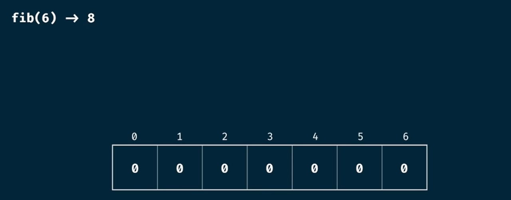 | 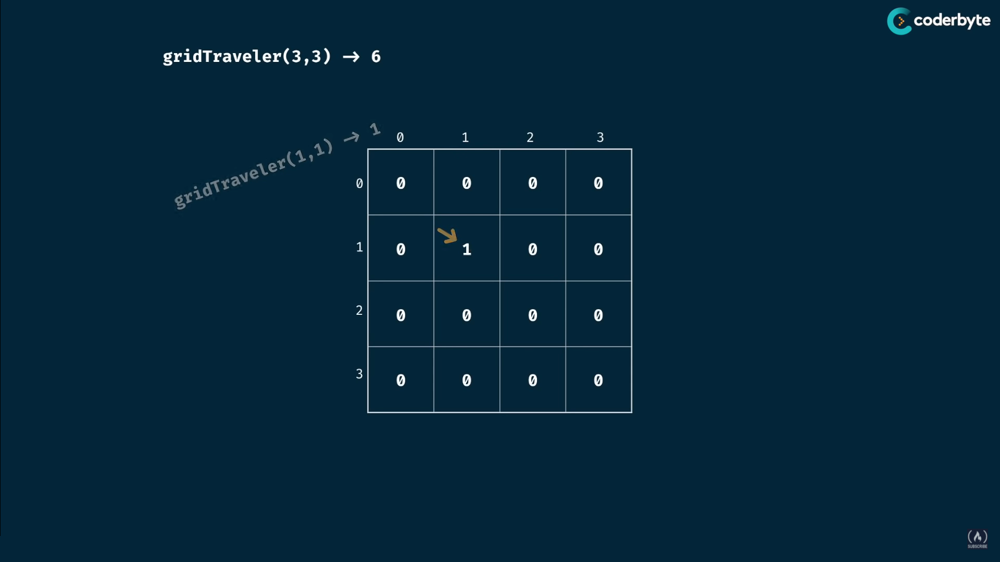
| ------------------- | -------------
| 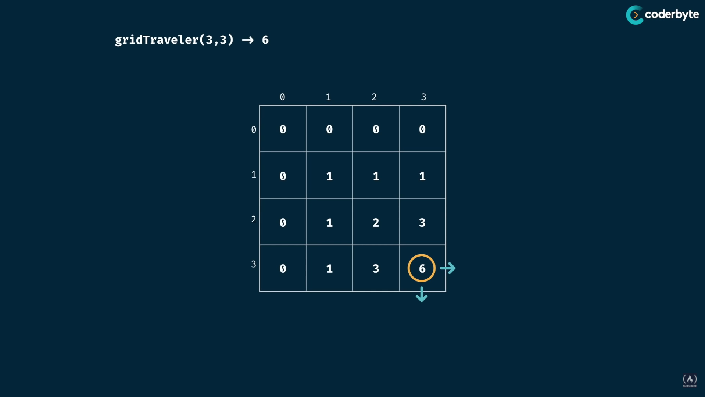 | 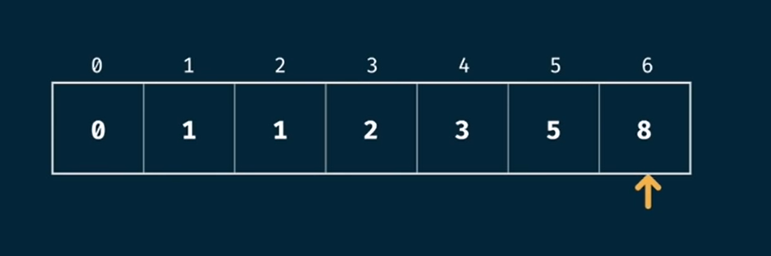

`O(n) time` <br>
`O(n) space`

```cs

```

<br>
<br>

# Change problems

## Can we make a change/sum?

Write a function `CanChange(target, coins)` that takes in a target amount and an array of coins.

The function should return a boolean indicating whether or not it is possible to generate the target amount using numbers from the array.

- You may use an element of the array as many times as needed.
- You may assume that all input numbers are nonnegative.

### Brute Force Solution

```cs
using System;
using System.Collections.Generic;

bool CanChange(int target, List<int> coins) {
    if (target == 0) return true;
    if (target < 0) return false;

    foreach (int coin in coins) {
        int diff = target - coin;
        if (CanChange(diff, coins)) {
            return true;
        }
    }

    return false;
}

Console.WriteLine(CanChange(7, new List<int>() {2, 3})); // True
Console.WriteLine(CanChange(7, new List<int>() {5, 3, 4, 7})); // True
Console.WriteLine(CanChange(7, new List<int>() {2, 4})); // False
Console.WriteLine(CanChange(8, new List<int>() {2, 3, 5})); // True
Console.WriteLine(CanChange(300, new List<int>() {7, 14})); // (...)
```

### Dynamic Programming Solution - Memoization

```cs
using System;
using System.Collections.Generic;
 
bool CanChange(int target, int[] coins, List<int> memo) {
    if (target == 0) return true;
    if (target < 0) return false;
    if (memo.Contains(target)) return false;

    foreach (int coin in coins) {
        int diff = target - coin;
        if (CanChange(diff, coins, memo)) {
            return true;
        }
        else if (!memo.Contains(diff) && diff > 0) { // optimization
            memo.Add(diff);
        }
    }

    return false;
}

Console.WriteLine(CanChange(7, new int[] {2, 3}, new List<int>())); // True
Console.WriteLine(CanChange(7, new int[] {5, 3, 4, 7}, new List<int>())); // True
Console.WriteLine(CanChange(7, new int[] {2, 4}, new List<int>())); // False
Console.WriteLine(CanChange(8, new int[] {2, 3, 5}, new List<int>())); // True
Console.WriteLine(CanChange(300, new int[] {7, 14}, new List<int>())); // False
```

<br>

## How can we make a change? - Memo

Write a function `HowChange(target, coins)` that takes in a target amount and an array of coins as arguments.

The function should return an array containing any combination of elements that add up to exactly the target amount. If theres is no combination that adds up to the target amount, then return null.

If there are multiple combinations possible, you may return any single one.

### Brute Force Solution

```cs
void print(List<int> nums)
{
    if (nums == null)
    {
        Console.WriteLine("null");
        return;
    }
    Console.WriteLine(string.Join(", ", nums));
    Console.WriteLine();
}

List<int> HowChange(int target, List<int> coins)
{
    if (target == 0) return new List<int>();
    if (target < 0) return null;

    foreach (int coin in coins)
    {
        int diff = target - coin;
        List<int> temp = HowSum(diff, coins);
        if (temp != null)
        {
            temp.Add(coin);
            return temp;
        }
    }

    return null;
}

print(HowChange(7, new List<int>() { 2, 3 })); // [3, 2, 2,]
print(HowChange(7, new List<int>() { 5, 3, 4, 7 })); // [4, 3]
print(HowChange(7, new List<int>() { 2, 4 })); // null
print(HowChange(8, new List<int>() { 2, 3, 5 })); // [2, 2, 2, 2]
print(HowChange(300, new List<int>() { 7, 14 })); // (...)
```

### Dynamic Programming Solution - Memoization 

```cs
void print(List<int> nums)
{
    if (nums == null)
    {
        Console.WriteLine("null");
        return;
    }
    Console.WriteLine(string.Join(", ", nums));
    Console.WriteLine();
}

List<int> HowChange(int target, List<int> coins, Dictionary<int, List<int>> memo)
{
    if (memo.ContainsKey(target)) return memo[target];
    if (target == 0) return new List<int>();
    if (target < 0) return null;

    foreach (int coin in coins)
    {
        int diff = target - coin;
        List<int> temp = HowChange(diff, coins, memo);
        if (temp != null)
        {
            temp.Add(coin);
            memo.Add(target, new List<int>(temp));
            return temp;
        }
    }

    memo.Add(target, null);
    return null;
}

print(HowChange(7, new List<int>() { 2, 3 })); // [3, 2, 2,]
print(HowChange(7, new List<int>() { 5, 3, 4, 7 })); // [4, 3]
print(HowChange(7, new List<int>() { 2, 4 })); // null
print(HowChange(8, new List<int>() { 2, 3, 5 })); // [2, 2, 2, 2]
print(HowChange(300, new List<int>() { 7, 14 })); // null
```

<br>

## Fewest Coin To Make Change - Memo

#### Input:

```cs
coins = [1, 2, 3]
goal = 10
------------------------
solution: 5 + 5 + 1 = 11
```

Top Down approach:

```cs
           11
/+1(-1)    |+1(-2)   \+1(-5)  
10          9          6
                   /   |   \
                  5    4    1
                              \
                               0
```

```cs
using System;

int LeastCoin(int[] coins, int amount)
{
    if(amount < 1) return 0;
    return FewestCoinChange(coins, amount, new int[amount + 1]);
}

int FewestCoinChange(int[] coins, int remainder, int[] dp)
{
    if(remainder < 0) return -1;
    if(remainder == 0) return 0;
    if(dp[remainder] != 0) return dp[remainder];

    int min = Int32.MaxValue;
    foreach(int coin in coins)
    {
        int changeResult = FewestCoinChange(coins, remainder - coin, dp);
        if(changeResult < min && changeResult >= 0){
            min = 1;
            min += changeResult;
        }
    }

    dp[remainder] = (min == Int32.MaxValue) ? -1 : min;
    return dp[remainder];
}

int[] coins = new int[]{1, 2, 3};
int goal = 10;
System.Console.WriteLine(LeastCoin(coins, goal)); // 4

coins = new int[]{1, 3, 5, 6, 9};
goal = 90;
System.Console.WriteLine(LeastCoin(coins, goal)); // 10
```

<br>

## Total Unique Ways To Make Change - Memo

Similar problems:
- Longest Common Subsequence - Memo

#### Input:

```cs
coins = [1, 2, 5]
amount = 5
------------------------
result = 4
```

| coins | 0 | 1 | 2 | 3 | 4 | 5
| ----  | - | - | - | - | - | -
| `[ ]`       | 1 | 0 | 0 | 0 | 0 | 0
| `[1]`       | 1 | 1 | 1 | 1 | 1 | 1
| `[(1),2]`   | 1 | 1 | 2 | 2 | 3 | 3
| `[(1,2),5]` | 1 | 1 | 2 | 2 | 3 | [4]


```cs
long TotalCoinChange(long[] coins, long amount)
{
    if(amount < 1) return 0;
    long n = coins.Length;
    long m = amount;
    long[,] memo = new long[n + 1, m + 1];

    memo[0, 0] = 1;
    for(int i = 1; i <= n; i++)
    {
        memo[i, 0] = 1;
        long coin = coins[i - 1];
        for(int j = 1; j <= m; j++){
            memo[i, j] = memo[i-1, j] + (j >= coin ? memo[i, j - coin] : 0);
        }
    }

    return memo[n, m];
}

System.Console.WriteLine( TotalCoinChange(new long[]{1,2,5}, 5) ); // 4
```
Time: `O(amount * #coins)` <br>
Space: `O(amount * #coins)`

<br>
<br>

# Popular problems

## LCS - Longest Common Subsequence - Memo

Similar problems:
- Total Unique Ways To Make Change - Memo

```cs
int Max(int a, int b) {
    return a >= b ? a : b;
}

int LCS(char[] x, char[] y, int n, int m) {
    int[,] memo = new int[n + 1, m + 1];

    for (int i = 0; i <= n; i++) {
        for (int j = 0; j <= m; j++) {
            if (i == 0 || j == 0) {
                memo[i, j] = 0;
            }
            else if (x[i - 1] == y[j - 1]) {
                memo[i, j] = memo[i-1, j-1] + 1;
            }
            else {
                memo[i, j] = Max(memo[i, j-1], memo[i-1, j]);
            }
        }
    }

    return memo[n, m];
}

string s1 = "ALMA";
string s2 = "KALAP";
int n = s1.Length;
int m = s2.Length;
System.Console.WriteLine(LCS( s1.ToCharArray(), s2.ToCharArray(), n, m)); // => 3
```

<br>


<br>
<br>
<br>
<br>
<br>