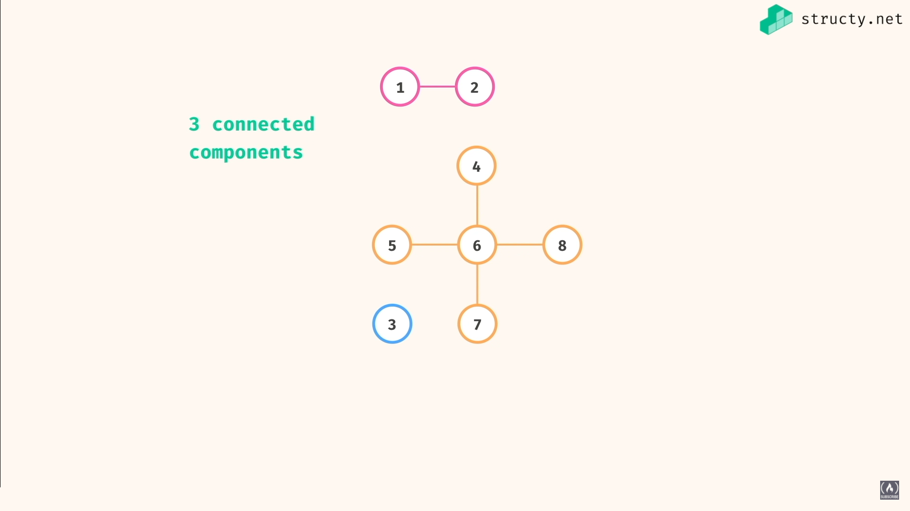
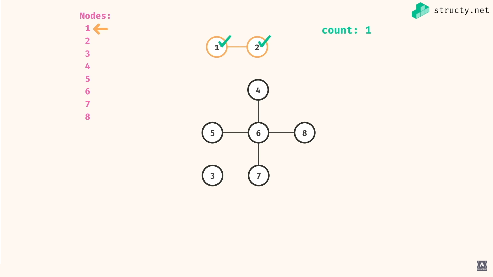
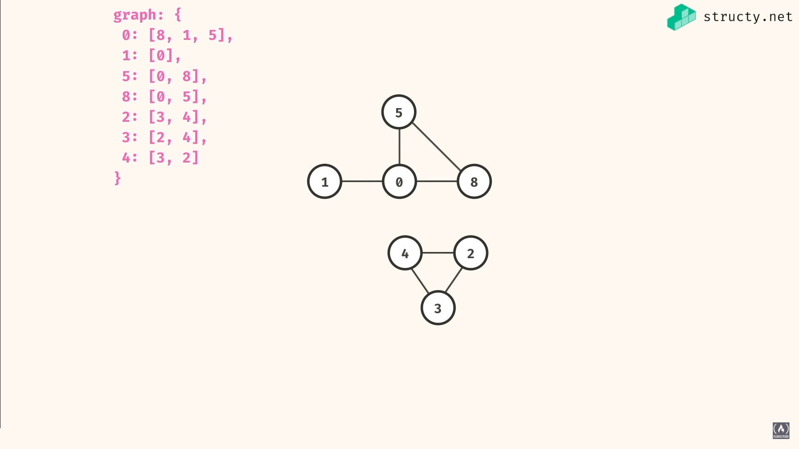
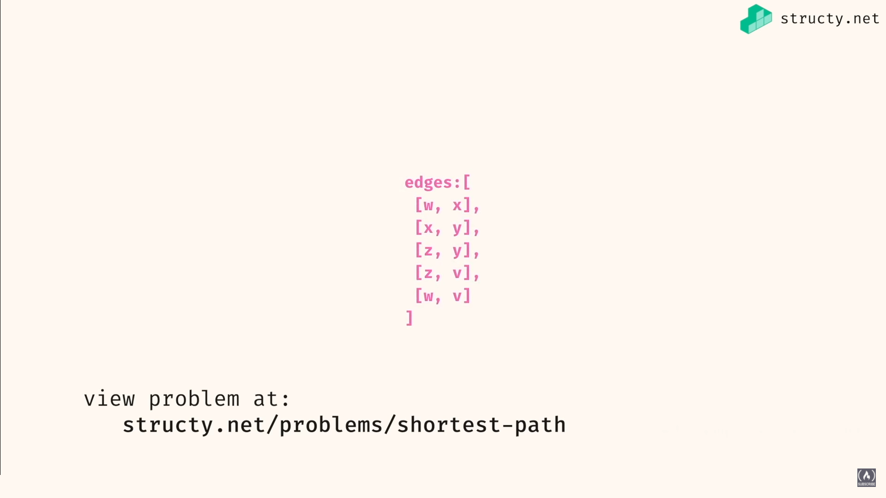
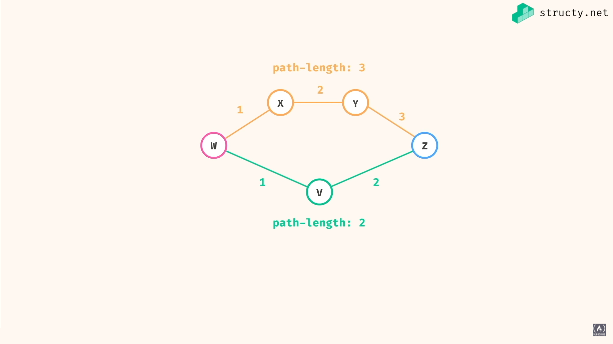
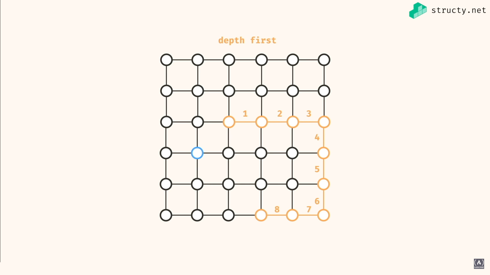
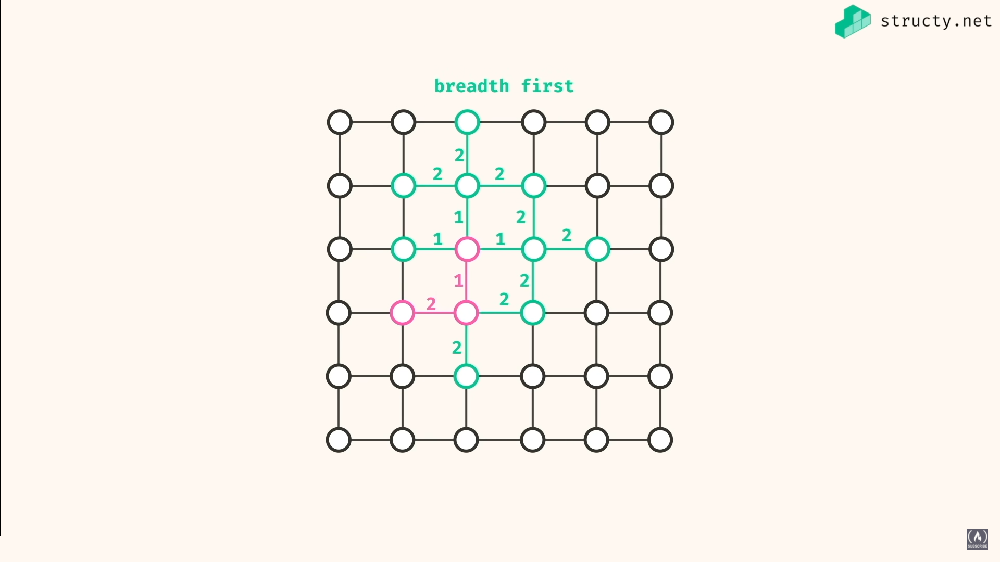
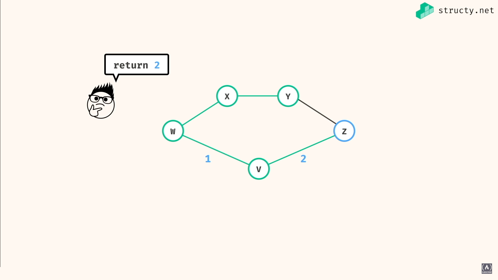

# Graph Algorithms for Technical Interviews - freeCodeCamp

### Reference: https://youtu.be/tWVWeAqZ0WU

<br>

|  | 
| ----------------------- | -----------------
|  | G

- Depth first: `Stack`
- Breadth first: `Queue`

## Depth

|   | 
| ------------- | -------------
|  |  
|  | 

## Breadth

|  | 
| -------------------------- | ------------
|  | 

<br>

## Depth first traversal

### JavaScript

```js
const depthFirstPrint = (graph, source) => {
    const stack = [source];

    while (stack.length > 0) {
        const current = stack.pop();
        console.log(current);
        for (let neighbor of graph[current]) {
            stack.push(neighbor);
        }
    }
};

const depthFirstRecursive = (graph, source) => {
    console.log(source);
    for (let neighbor of graph[source]) {
        depthFirstRecursive(graph, neighbor);
    };
};

const graph = {
    a: ['b', 'c'],
    b: ['d'],
    c: ['e'],
    d: ['f'],
    e: [],
    f: []
};


depthFirstPrint(graph, 'a'); // acebdf
console.log();
depthFirstRecursive(graph, 'a'); // abdfce
```

###  C#

```cs
using System;
using System.Collections.Generic;

void DepthFirstPrint(Dictionary<char, List<char>> graph, char source)
{
    Stack<char> stack = new Stack<char>();
    stack.Push(source);
    while (stack.Count > 0)
    {
        char current = stack.Pop();
        Console.Write(current + ", ");
        foreach (char neighbor in graph[current])
        {
            stack.Push(neighbor);
        }
    }
}

void DepthFirstRecursive(Dictionary<char, List<char>> graph, char source)
{
    Console.Write(source + ", ");
    foreach (char neighbor in graph[source])
    {
        DepthFirstRecursive(graph, neighbor);
    }
}

Dictionary<char, List<char>> graph = new Dictionary<char, List<char>>()
{
    ['a'] = new List<char>() { 'b', 'c' },
    ['b'] = new List<char>() { 'd' },
    ['c'] = new List<char>() { 'e' },
    ['d'] = new List<char>() { 'f' },
    ['e'] = new List<char>(),
    ['f'] = new List<char>()
};

DepthFirstPrint(graph, 'a'); //acebdf
Console.WriteLine();
DepthFirstRecursive(graph, 'a'); //abdfce
```

## Breadth first traversal

###  JavaScript

```js
const breadthFirstPrint = (graph, source) => {
    const queue = [source];
    while (queue.length > 0) {
        const current = queue.shift();
        console.log(current);
        for (let neighbor of graph[current]) {
            queue.push(neighbor);
        }
    }
};

const graph = {
    a: ['b', 'c'],
    b: ['d'],
    c: ['e'],
    d: ['f'],
    e: [],
    f: []
};

breadthFirstPrint(graph, 'a'); // abcdef
```

### C#

```cs
using System;
using System.Collections.Generic;

void BreadthFirstPrint(Dictionary<char, List<char>> graph, char source)
{
    Queue<char> queue = new Queue<char>();
    queue.Enqueue(source);
    while (queue.Count > 0)
    {
        char current = queue.Dequeue();
        Console.Write(current + ", ");
        foreach (char neighbor in graph[current])
        {
            queue.Enqueue(neighbor);
        }
    }
    Console.WriteLine(string.Join(", ", queue));
}

Dictionary<char, List<char>> graph = new Dictionary<char, List<char>>()
{
    ['a'] = new List<char>() { 'b', 'c' },
    ['b'] = new List<char>() { 'd' },
    ['c'] = new List<char>() { 'e' },
    ['d'] = new List<char>() { 'f' },
    ['e'] = new List<char>(),
    ['f'] = new List<char>()
};

BreadthFirstPrint(graph, 'a'); //abcdef
```

# Problem solving

## has path - no cycle

|  | 
| -------------------------- | ---------------------
|   | 
|  | 

### Depth

```js
const hasPath = (graph, src, dest) => {
    if (src == dest) return true;

    for (let neighbor of graph[src]) {
        if (hasPath(graph, neighbor, dest) == true) {
            return true;
        }
    }

    return false;
};

const graph = {
    f: ['g', 'i'],
    g: ['h'],
    h: [],
    i: ['g', 'k'],
    j: ['i'],
    k: []
};

console.log(hasPath(graph, 'f', 'k')); // true
console.log(hasPath(graph, 'f', 'j')); // false
```

###  Breath

### Depth

```js
const hasPath = (graph, src, dest) => {
    const queue = [];
    queue.push(src);

    while (queue.length > 0) {
       const curr = queue.shift();
        if (curr == dest) return true;
        for (let neighbor of graph[curr]) {
            queue.push(neighbor);
        }
    }

    return false;
};

const graph = {
    f: ['g', 'i'],
    g: ['h'],
    h: [],
    i: ['g', 'k'],
    j: ['i'],
    k: []
};

console.log(hasPath(graph, 'f', 'k')); // true
console.log(hasPath(graph, 'f', 'j')); // false
```

<br>

## undirected path

|  | 
| ------------------------- | -----------
|  | 
|  | 
|  | 
|  | 

<br>

- first we have to convert our edges list into an adjacency list `buildGraph()`

```js
const undirectedGraph = (edges, nodeA, nodeB) => {
    const graph = buildGraph(edges);
    return hasPath(graph, nodeA, nodeB, new Set());
};

const hasPath = (graph, src, dest, visited) => {
    if (visited.has(src)) return false;
    if (src == dest) return true;

    for (let neighbor of graph[src]) {
        visited.add(src);
        if (hasPath(graph, neighbor, dest, visited) == true) {
            return true;
        }
    }
 
    return false;
};

const buildGraph = (edges) => {
    const graph = {};

    for (let edge of edges) {
        const [a, b] = edge;
        if (!(a in graph)) graph[a] = [];
        if (!(b in graph)) graph[b] = [];
        graph[a].push(b);
        graph[b].push(a);
    }

    return graph;
};

const edges = [
    ['i', 'j'],
    ['k', 'i'],
    ['m', 'k'],
    ['k', 'l'],
    ['o', 'n']
];

console.log(undirectedGraph(edges, 'j', 'm')); // -> true
console.log(undirectedGraph(edges, 'i', 'n')); // -> false
```

<br>

## connected components count

|  | 
| ------------------------- | -------
|  | 

### JS

```js
const connectedComponentsCount = (graph) => {
    const visited = new Set();
    let count = 0;
    for (let node in graph) {
        if (explore(graph, node, visited) == true) {
            count++;
        }
    }

    return count;
}; 

const explore = (graph, current, visited) => {
    if (visited.has(String(current))) return false;

    visited.add(String(current));

    for (let neighbor of graph[current]) {
        explore(graph, neighbor, visited);
    }

    return true;
};

const graph = {
    0: [8, 1, 5],
    1: [0],
    5: [0, 8],
    8: [0, 5],
    2: [3, 4],
    3: [2, 4],
    4: [3, 2]
};

const graph2 = {
    1: [2],
    2: [1],
    3: [],
    4: [6],
    5: [6],
    6: [4, 5, 8, 7],
    7: [6],
    8: [6]
};

console.log(connectedComponentsCount(graph)); // -> 2
console.log(connectedComponentsCount(graph2)); // -> 3
```

### C#

```cs
using System;
using System.Collections.Generic;

int ConnectedComponentsCount(Dictionary<int, List<int>> graph)
{
    HashSet<int> visited = new HashSet<int>();
    int field_count = 0;
    foreach (KeyValuePair<int, List<int>> node in graph)
    {
        if (Explore(graph, node.Key, visited) == true)
        {
            field_count++;
        }
    }
    return field_count;
}

bool Explore(Dictionary<int, List<int>> graph, int current, HashSet<int> visited)
{
    if (visited.Contains(current)) return false;
    visited.Add(current);

    foreach (int neighbor in graph[current])
    {
        Explore(graph, neighbor, visited);
    }

    return true;
}

Dictionary<int, List<int>> graph = new Dictionary<int, List<int>>()
{
    [0] = new List<int>() { 8, 1, 5 },
    [1] = new List<int>() { 0 },
    [5] = new List<int>() { 0, 8 },
    [8] = new List<int>() { 0, 5 },

    [2] = new List<int>() { 3, 4 },
    [3] = new List<int>() { 2, 4 },
    [4] = new List<int>() { 3, 2 }
};

Dictionary<int, List<int>> graph2 = new Dictionary<int, List<int>>()
{
    [1] = new List<int>() { 2 },
    [2] = new List<int>() { 1 },

    [3] = new List<int>(),

    [4] = new List<int>() { 6 },
    [5] = new List<int>() { 6 },
    [6] = new List<int>() { 4, 5, 8, 7 },
    [7] = new List<int>() { 6 },
    [8] = new List<int>() { 6 }
};

Console.WriteLine(ConnectedComponentsCount(graph)); //-> 2
Console.WriteLine(ConnectedComponentsCount(graph2)); //-> 0
```

<br>

## largest component

|  | 
| ------------------------- | -----------------------------

### C#

```cs
using System;
using System.Collections.Generic;

int LargestComponent(Dictionary<int, List<int>> graph)
{
    HashSet<int> visited = new HashSet<int>();
    int max = 0; //size of the largest component
    foreach (KeyValuePair<int, List<int>> node in graph)
    {
        int curr = Explore(graph, node.Key, visited);
        max = curr > max ? curr : max;
    }

    return max;
}

int Explore(Dictionary<int, List<int>> graph, int current, HashSet<int> visited)
{
    if (visited.Contains(current)) return 0;
    visited.Add(current); 
    int field_size = 1;
    foreach (int neighbor in graph[current])
    {
        field_size += Explore(graph, neighbor, visited);
    }

    return field_size;
}

Dictionary<int, List<int>> graph = new Dictionary<int, List<int>>()
{
    [0] = new List<int>() { 8, 1, 5 },
    [1] = new List<int>() { 0 },
    [5] = new List<int>() { 0, 8 },
    [8] = new List<int>() { 0, 5 },

    [2] = new List<int>() { 3, 4 },
    [3] = new List<int>() { 2, 4 },
    [4] = new List<int>() { 3, 2 }
};

Dictionary<int, List<int>> graph2 = new Dictionary<int, List<int>>()
{
    [1] = new List<int>() { 2 },
    [2] = new List<int>() { 1 },

    [3] = new List<int>(),

    [4] = new List<int>() { 6 },
    [5] = new List<int>() { 6 },
    [6] = new List<int>() { 4, 5, 8, 7 },
    [7] = new List<int>() { 6 },
    [8] = new List<int>() { 6 }
};

Console.WriteLine(LargestComponent(graph)); //-> 4
Console.WriteLine(LargestComponent(graph2)); //-> 5
```

<br>

## sortest path

|  | 
| ------------------------- | ------------
|  | 

**Breath first is better in this case, depth first could be unlucky**

|  | 
| --------------------------| -----------
|  | 


<br>
<br>
<br>
<br>