# Binary Tree Algorithms for Technical Interviews

### Reference: https://youtu.be/fAAZixBzIAI

<br>

| 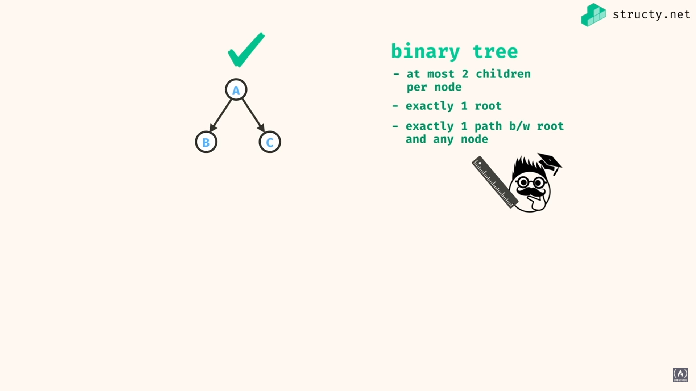| 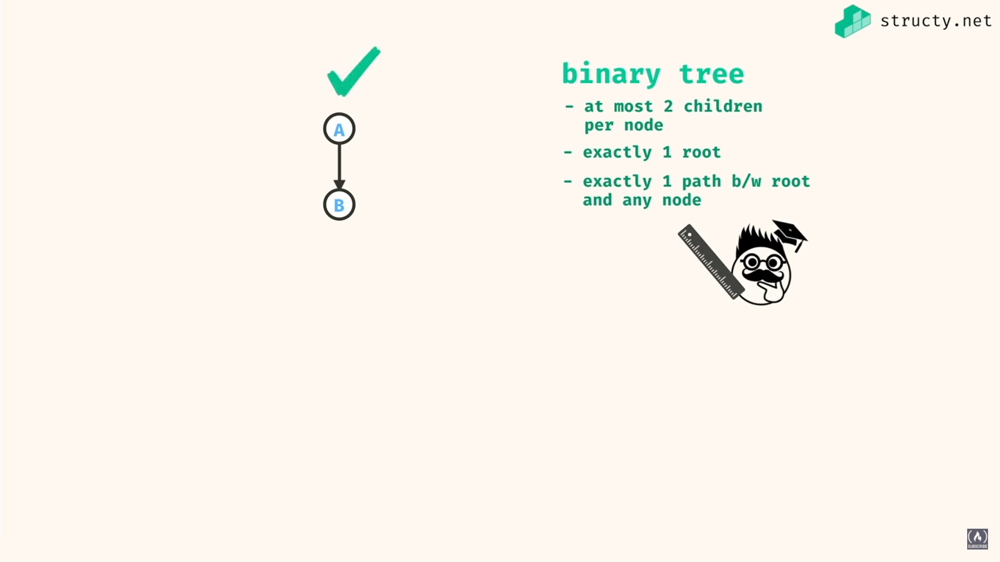
| ------------------- | ---------------
| 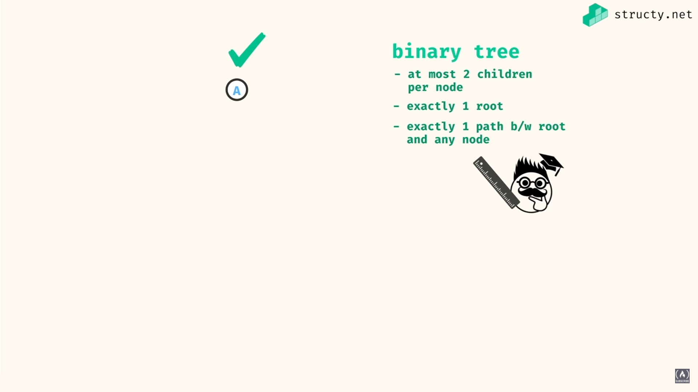| 
| 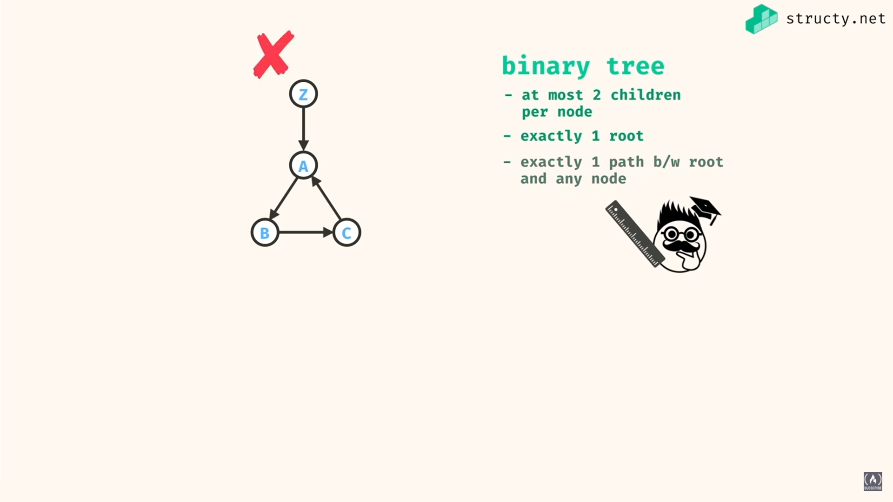 | 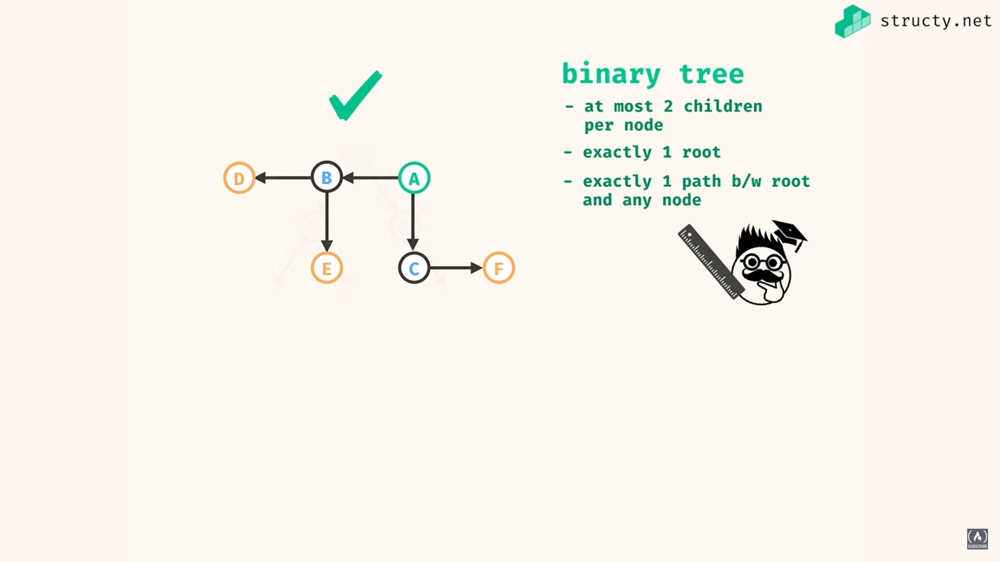
| 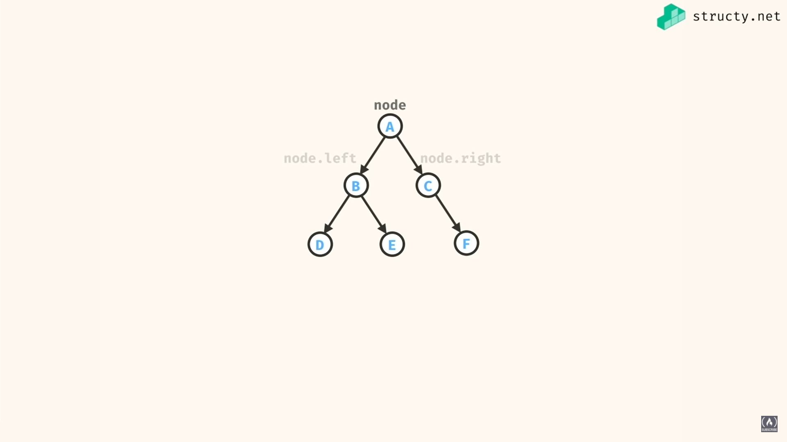 | 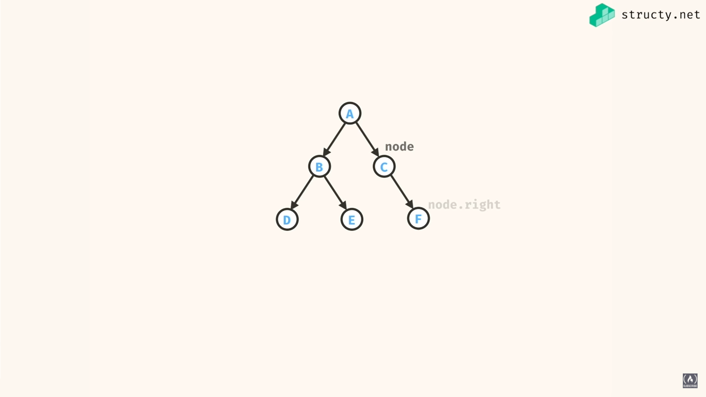

<br>

```cs
class Node
{
    public int val;
    public Node right;
    public Node left;

    public Node(int val)
    {
        this.val = val;
        this.left = null;
        this.right = null;
    }
}

class Program
{
    static void Main()
    {
        Node a = new Node('a');
            Node b = new Node('b');
                Node d = new Node('d');
                Node e = new Node('e');
            Node c = new Node('c');
                Node f = new Node('f');
        
        a.left = b;
        a.right = c;
        b.left = d;
        b.right = e;
        c.right = f;

        //             a
        //           /   \
        //          b     c
        //         /  \     \
        //        d    e     f
    }
}
```

## depth first values

| 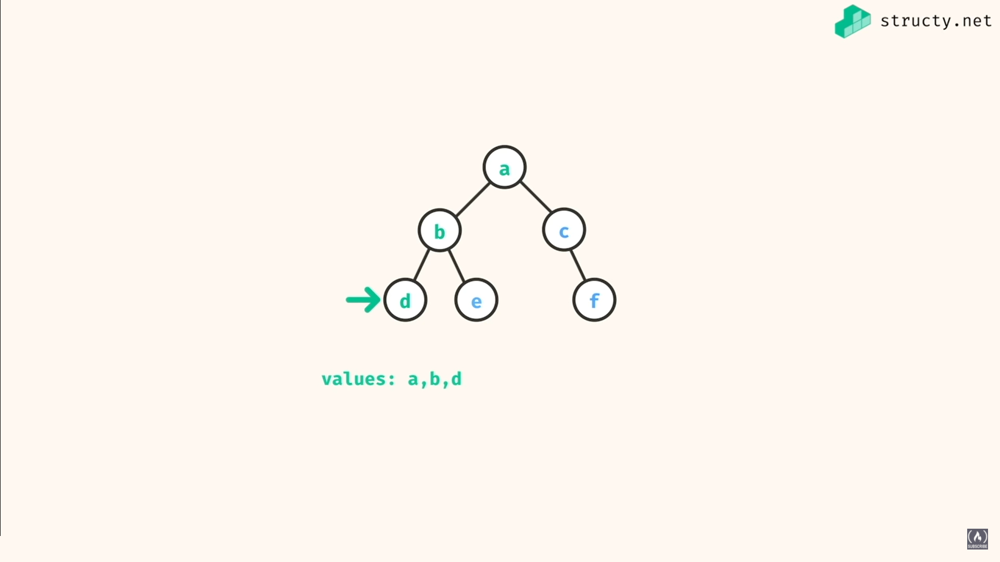 | 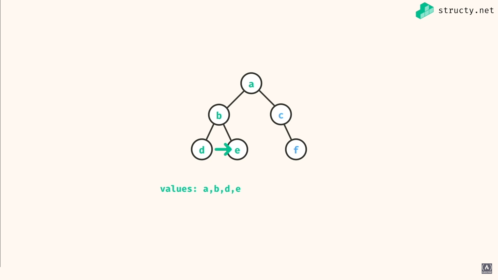
| ----------------------- | ---------------------------

```cs
using System;
using System.Collections.Generic;

class Node
{
    public int val;
    public Node right;
    public Node left;

    public Node(int val)
    {
        this.val = val;
        this.left = null;
        this.right = null;
    }
}

class Program
{
    static void DepthFirstValuesRec(Node root)
    {
        if (root == null) return;
        Console.Write((char)root.val + " ");
        DepthFirstValuesRec(root.left);
        DepthFirstValuesRec(root.right);
    }

    static void DepthFirstValuesIterative(Node root)
    {
        Stack<Node> stack = new Stack<Node>();
        stack.Push(root);
        while (stack.Count > 0)
        {
            Node curr = stack.Pop();
            if (curr != null)
            {
                Console.Write((char)curr.val + " ");
                stack.Push(curr.right);
                stack.Push(curr.left);
            }
        }
    }

    static void Main()
    {
        Node a = new Node('a');
            Node b = new Node('b');
                Node d = new Node('d');
                Node e = new Node('e');
            Node c = new Node('c');
                Node f = new Node('f');
        
        a.left = b;
        a.right = c;
        b.left = d;
        b.right = e;
        c.right = f;

        //             a
        //           /   \
        //          b     c
        //         /  \     \
        //        d    e     f

        DepthFirstValuesRec(a); //abdecf
        Console.WriteLine();
        DepthFirstValuesIterative(a); //abdecf
    }
}
```

## breath first values

```cs
static void BreathFirstValues(Node root)
{
    Queue<Node> queue = new Queue<Node>();
    queue.Enqueue(root);
    while (queue.Count > 0)
    {
        Node current = queue.Dequeue();
        if (current != null)
        {
            Console.Write(current.val + " ");
            queue.Enqueue(current.left);
            queue.Enqueue(current.right);
        }
    }
}
```

## Tree Includes

Check if a value in the BTree

```cs
    static bool BreathFirstValues(Node root, int target)
    {
        Queue<Node> queue = new Queue<Node>();
        queue.Enqueue(root);
        while (queue.Count > 0)
        {
            Node current = queue.Dequeue();
            if (current != null)
            {
                if (current.val == target) return true;
                if (current.left != null) queue.Enqueue(current.left);
                if (current.right != null) queue.Enqueue(current.right);
            }
        }

        return false;
    }
```

### With Depth Recursion - recursion is more common

| 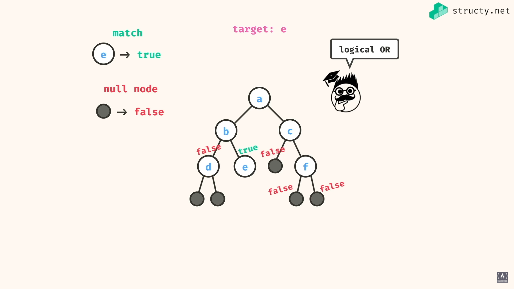 | 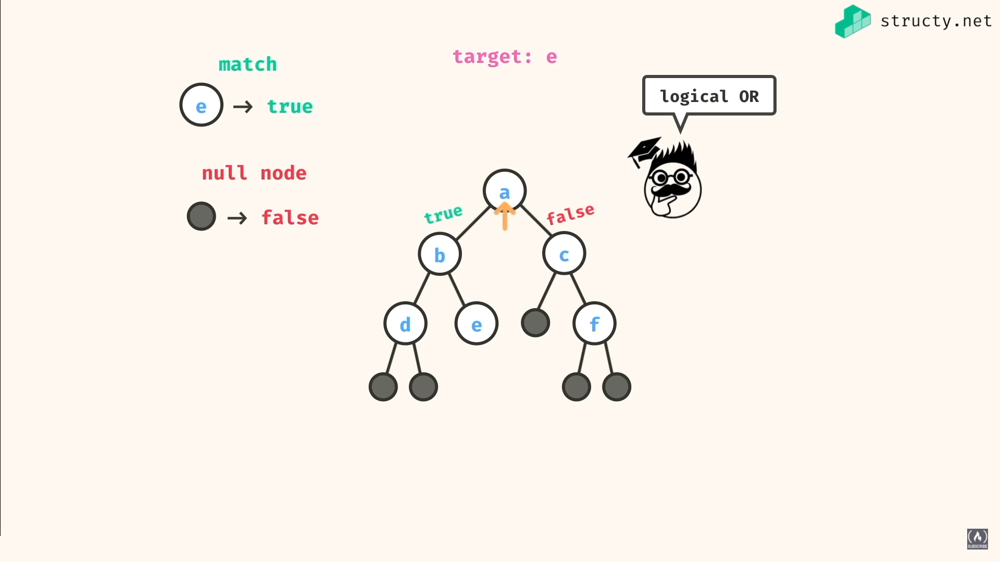
| ------------------------- | -------------------------

```cs
static bool DepthFirstSearch(Node root, int target)
{
    if (root == null) return false;
    if (root.val == target) return true;
    if (DepthFirstSearch(root.left, target)) return true;
    if (DepthFirstSearch(root.right, target)) return true;
    return false;
}
```

## Tree Sum

```cs
static int DepthFirstSum(Node root)
{
    if (root == null) return 0;
    int sum = root.val;
    sum += DepthFirstSum(root.left);
    sum += DepthFirstSum(root.right);
    return sum;
}
```

## Tree Min/Max Value

```cs
static int DepthFirstMin(Node root)
{
    if (root == null) return Int32.MaxValue;
    int min = root.val;
    int left_min = DepthFirstMin(root.left);
    min = left_min < min ? left_min : min;

    int right_min = DepthFirstMin(root.right);
    min = right_min < min ? right_min : min;
    return min;
}
```

## Max Root to Leaf Path Sum

```cs
static int DFMaxPathSum(Node root)
{
    if (root == null) return Int32.MinValue;
    if (root.left == null && root.right == null) return root.val;
    return root.val + Math.Max(DFMaxPathSum(root.left), DFMaxPathSum(root.right));
}
```

<br>

**Ende.**

**Reference: https://youtu.be/fAAZixBzIAI**

<br>
<br>
<br>