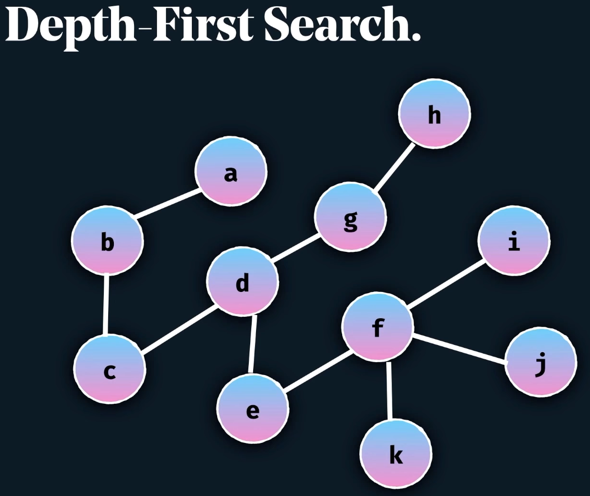

# Recursion

Main References: 
- https://www.youtube.com/watch?v=IJDJ0kBx2LM
- https://www.youtube.com/channel/UClEEsT7DkdVO_fkrBw0OTrA

## String Reversal.

```java
public class Solution{
    public static void main(String[] args){
        System.out.println(reverseString("alma")); // amla
    }
     
    public static String reverseString(String input){
        if(input.equals("")){
            return "";
        }
        
        return reverseString(input.substring(1)) + input.charAt(0);
    }
}
```

## isPalindrome.

```java
public class Solution{
    public static void main(String[] args){
        System.out.println(isPalindrome("kayak")); // TRUE
    }

    public static boolean isPalindrome(String input){

        if(input.length() == 1 || input.length() == 0){
            return true;
        }

        if(input.charAt(0) == input.charAt( input.length() - 1 )){
            return isPalindrome( input.substring(1, input.length() - 1 ));
        }
        else{
            return false;
        }
    }
}
```

## Decimal to Binary.

```java
public class Solution{
    public static void main(String[] args){

        System.out.println(findBinary(233,"")); // "11101001"
    }

    public static String findBinary(int decimal, String result){

        if(decimal == 0){
            return result;
        }

        result = decimal % 2 + result;
        return findBinary(decimal / 2, result);
    }
}
```

## Sum of Natural Numbers.

```java
public class Solution{
    public static void main(String[] args){
        System.out.println(sumOfNumbers(10)); // 55
    }

    public static int sumOfNumbers(int n){
        return n == 0 ? n : n + sumOfNumbers(n-1);
    }
}
```

## Binary Search.

```java
public class Solution{
    public static void main(String[] args) {
        int[] A = new int[]{-1,0,1,2,3,4,7,9,10,20};
        System.out.println(binarySearch(A, 0, A.length-1, 10)); // 8
    }

    public static int binarySearch(int[] A, int left, int right, int x){
        if(left > right){
            return -1;
        }

        int mid = (left + right) / 2;

        if(x == A[mid]){
            return mid;
        }

        if(x < A[mid]){
            return binarySearch(A, left, mid - 1, x);
        }

        return binarySearch(A, mid + 1, right, x);
    }
}
```

## Fibonacci (Non-Optimized).

```java
public class Solution{
    public static void main(String[] args) {
        System.out.println( fib(10) );
    }

    public static long fib(long n){
        if(n == 0 || n == 1){
            return n;
        }
        else{
            return fib(n-1) + fib(n-2);
        }
    }
}
```

## Fibonacci Dynamic.

```java
public class Solution {
    public static void main(String[] args) {

        HashMap<Long, Long> memo = new HashMap<>();
        long n = 6;
        System.out.println(fib(n, memo));
    }

    public static long fib(long n, HashMap<Long, Long> memo){
        if(memo.containsKey(n)){
            return memo.get(n);
        }
        if(n <= 2){
            return 1;
        }
        memo.put(n, fib(n-1, memo) + fib(n-2, memo));
        return memo.get(n);
    }
}
```

## Merge Sort `O(nlogn) in worst case`.

```java
public class Solution{
    public static void main(String[] args) {
        int[] data = new int[]{-5, 20, 10, 3, 2, 0};
        mergeSort(data, 0, data.length-1);
        System.out.println("stop");
        for(int i=0; i<data.length-1; i++){
            System.out.println(data[i]);
        }
    }

    public static void mergeSort(int[] data, int start, int end){
        if(start < end){
            int mid = (start + end) / 2;
            mergeSort(data, start, mid);
            mergeSort(data, mid+1, end);
            merge(data, start, mid, end);
        }
    }

    public static void merge(int[] data, int start, int mid, int end){
        // build temp array to avoid modifying the original contents
        int[] temp = new int[end - start + 1];

        int i = start, j = mid + 1, k = 0;

        // While both sub-array have values, then try and merge them in sorted order
        while( i <= mid && j <= end){
            if( data[i] <= data[j]){
                temp[k++] = data[i++];
            }
            else{
                temp[k++] = data[j++];
            }
        }

        // Add the rest of the values from the lest sub-array into the result
        while(i <= mid){
            temp[k++] = data[i++];
        }
        while(j <= end){
            temp[k++] = data[j++];
        }

        for(i = start; i <= end; i++){
            data[i] = temp[i-start];
        }
    }
}
```

## Merge sort with Dynamic Array.

```java
import java.util.ArrayList;
import java.util.List;
import java.util.Scanner;

public class Solution{
    public static void main(String[] args){
        Scanner sc = new Scanner(System.in);
        List<Integer> data = new ArrayList<>();
        int n;

        System.out.println("Number of elements: ");
        n = Integer.parseInt(sc.nextLine());
        for(int i = 0; i < n; i++){
            data.add( Integer.parseInt(sc.nextLine()) );
        }

        mergeSort(data,0,data.size()-1);

        System.out.println("After sorting: ");
        for(int i = 0; i < data.size(); i++){
            System.out.print(data.get(i) + " ");
        }
    }

    public static void mergeSort(List<Integer> data, int start, int end){
        if(start < end){
            int mid = (start + end) / 2;
            mergeSort(data, start, mid);
            mergeSort(data, mid + 1, end);
            merge(data, start, mid, end);
        }
    }

    public static void merge(List<Integer> data, int start, int mid, int end){
        // build temp array to avoid modifying the original contents
        List<Integer> temp = new ArrayList<>();

        int i = start;
        int j = mid + 1;
        while(i <= mid  && j <= end){
            if(data.get(i) <= data.get(j)){
                temp.add(data.get(i++));
            }
            else{
                temp.add(data.get(j++));
            }
        }

        while(i <= mid){
            temp.add(data.get(i++));
        }

        while(j <= end){
            temp.add(data.get(j++));
        }

        for(i = start; i <= end; i++){
            data.set(i, temp.get(i - start));
        }
    }
}
```

## Reverse Linked Lists.

### JAVA

```java
class Solution{
    static class Node{
        private int data;
        private Node next;

        public Node(int data){
            this.data = data;
        }

        public void setNext(Node node){
            this.next = node;
        }

        public Node getNext(){
            return next;
        }
    }

    public static void main(String[] args) {
        Node n1 = new Node(1);
        Node n2 = new Node(2);
        Node n3 = new Node(3);
        Node n4 = new Node(4);
        Node n5 = new Node(5);
        n1.setNext(n2);
        n2.setNext(n3);
        n3.setNext(n4);
        n4.setNext(n5);

        System.out.println("Original NodeList: ");
        printLinkedList(n1);

        System.out.println("Reversed NodeList: ");
        Node reversed = reverseList(n1);
        printLinkedList(reversed);
    }

    public static Node reverseList(Node head){
        if(head == null || head.next == null){
            return head;
        }
        Node p = reverseList(head.next);
        head.next.next = head;
        head.next = null;
        return p;
    }

    public static void printLinkedList(Node node){
        Node temp = node;
        while(temp != null){
            System.out.print(temp.data + " ");
            temp = temp.getNext();
        }
        System.out.println();
    }
}
```

### C#

```cs
public class Node
{
    public int data;
    public Node next;

    public Node(int data)
    {
        this.data = data;
    }
}

public class Solution
{
    public static void Main(string[] args)
    {
        Node n1 = new Node(1);
        Node n2 = new Node(2);
        Node n3 = new Node(3);
        Node n4 = new Node(4);
        Node n5 = new Node(5);
        n1.next = n2;
        n2.next = n3;
        n3.next = n4;
        n4.next = n5;

        System.Console.WriteLine("Before reversing: ");
        printNodeList(n1);

        System.Console.WriteLine("After reversing: ");
        Node reversed = reverseNodeList(n1);
        printNodeList(reversed);
    }

    public static Node reverseNodeList(Node head)
    {
        if(head == null || head.next == null)
        {
            return head;
        }
        Node p = reverseNodeList(head.next);
        head.next.next = head;
        head.next = null;
        return p;
    }

    public static void printNodeList(Node head)
    {
        Node temp = head;
        while(temp != null)
        {
            System.Console.Write(temp.data + " ");
            temp = temp.next;
        }
        System.Console.WriteLine();
    }
}
```

## Merge Two Sorted Linked Lists.

```java
public static Node sortedMerge(Node A, Node B){
    if(A == null){
        return B;
    }
    if(B == null){
        return A;
    }

    if(A.data < B.data){
        A.next = sortedMerge(A.next, B);
        return A;
    }
    else{
        B.next = sortedMerge(A, B.next);
        return B;
    }
}
```

## Insert Value Into Binary Search Tree.

**Binary Tree**: a tree in which each node can have at most 2 children

```c
struct Node{
    int data;
    Node* left;
    Node* right;
};    
```

### Binary Search Tree - BST

- a binary tree in which for each node, value of all the nodes in left subtree is lesser or equal and value of all the nodes in right subtree is greater.


We want to be able to perform below operations:
- `Search(x) // search for an element x`
- `Insert(x) // insert an element x`
- `Remove(x) // remove an element x`

| operation  | Array <br> (unsorted) | Linked List | Array <br> (sorted) | BST <br> (balanced)
| ---------   | -------------------- |------------- | ------------------ | ------
| `Search(x)` | `O(n)` | `O(n)` | `O(logn)` | `O(logn)`
| `Insert(x)` | `O(1)` | `O(1)` | `O(n)` | `O(logn)`
| `Remove(x)` | `O(n)` | `O(n)` | `O(n)` |  `O(logn)`

We can perform **Binary Search** in a sorted array in `O(logn)`

https://en.wikipedia.org/wiki/Time_complexity

```java
import java.util.List;

class Node{
    int data;
    Node left;
    Node right;

    public Node(int data){
        this.data = data;
        left = right = null;
    }
}

class Solution{
    public static void main(String[] args) {
        List<Integer> dataInput = List.of(100, 80, 50, 90, 30, 60, 90,
                85, 95, 120, 110, 108, 115, 140, 150);
        
        Node root = null;
        for(Integer node : dataInput){
            root = insertNode(root, node);
        }

        insertNode(root, 160);
        printLeaves(root);
    }

    public static void printLeaves(Node root){
        if(root == null){
            return;
        }

        // Checks if a given node is a leaf
        if(root.left == null && root.right == null){
            System.out.print(root.data + ", ");
            return;
        }

        if(root.left != null){
            printLeaves(root.left);
        }
        if(root.right != null){
            printLeaves(root.right);
        }
    }

    public static Node insertNode(Node head, int data){
        if(head == null){
            head = new Node(data);
            return head;
        }

        if(head.data < data){
            head.right = insertNode(head.right, data);
        }
        else{
            head.left = insertNode(head.left, data);
        }

        return head;
    }
}
```
  
## Depth-First Search. Graphs



```java
boolean depthFirstSearch(Node node, Set<Node> visited, int goal){
    if(node == null){
        return false;
    }

    if(node.data == goal){
        return true;
    }

    for(Node neighbor : node.getNeighbors()){
        if(!visited.contains(neighbor)){
            visited.add(neighbor);
            boolean isFound = depthFirstSearch(neighbor, visited, goal);
            if(isFound){
                return true;
            }
        }
    }
    return false;
}
```

### Connected Cells in a Grid

https://www.hackerrank.com/challenges/connected-cell-in-a-grid/problem


```cs
public static int connectedCell(List<List<int>> m)
{
    int max = 0;
    int curr;
    for (int i = 0; i < m.Count; i++)
    {
        for (int j = 0; j < m[i].Count; j++)
        {
            if (m[i][j] == 1)
            {
                curr = countCells(m, i, j);
                if (curr > max)
                {
                    max = curr;
                }
            }
        }
    }

    return max;
}

public static int countCells(List<List<int>> m, int i, int j)
{
    if (i < 0 || j < 0 || i >= m.Count || j >= m[i].Count || m[i][j] == 0)
    {
        return 0;
    }

    int cc = 1;
    m[i][j] = 0;

    cc += countCells(m, i - 1, j - 1);
    cc += countCells(m, i + 1, j + 1);
    cc += countCells(m, i - 1, j);
    cc += countCells(m, i + 1, j);
    cc += countCells(m, i, j - 1);
    cc += countCells(m, i, j + 1);
    cc += countCells(m, i - 1, j + 1);
    cc += countCells(m, i + 1, j - 1);

    return cc;
}
```


## Memoization & Caching.

How can we speed up our program by "caching" things we've already done? - See Dynamic Programming.

## Tail-Call Recursion Optimization

Compiler optimization in certain languages to reduce stack overflows.
- This works by ensuring the last function call is a recursive one (see codes below)
- **Rule of thumb**: Make the recursive call the last instruction
- Supported by mostly all functional languages. <br> Not supported by Python, Java. Supported for JS in Safari

```java
int factorial(int x){
    if(x > 0){
        return x*factorial(x-1);
    }
    return 1;
}
```

```java
int factorial(int x){
    return tailfactorial(x , 1);            
}        

int tailfactorial(int x, int multiplier){
    if(x > 0){
        return tailfactorial(x-1, x * multiplier);
    }
    return multiplier;
}
```

<br>
<br>
<br>
<br>
<br>