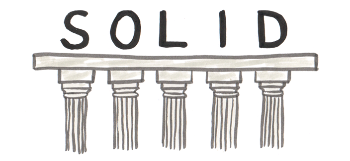
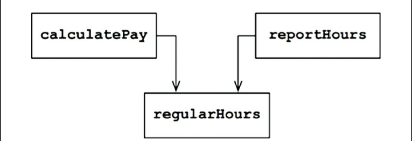
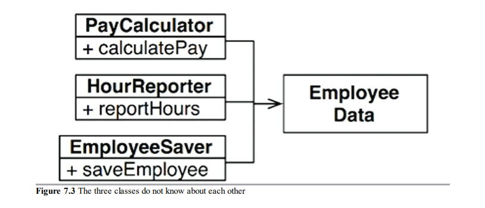
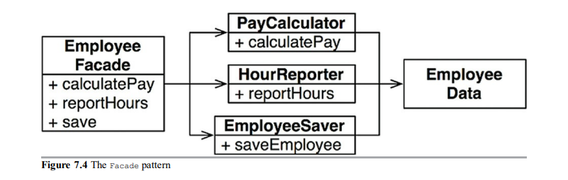
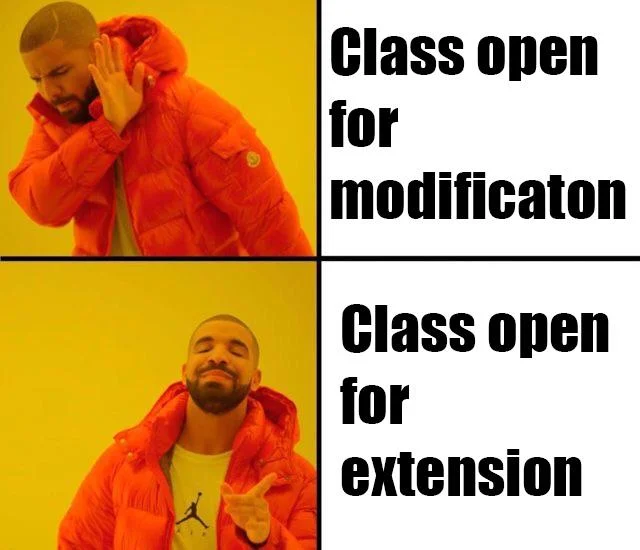
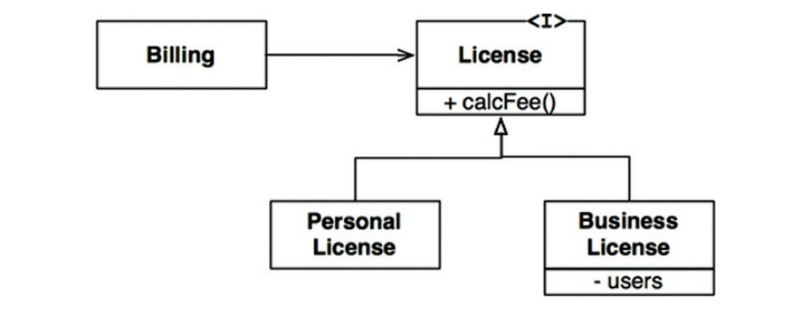
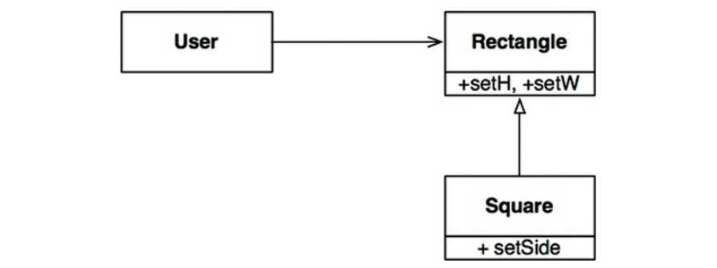
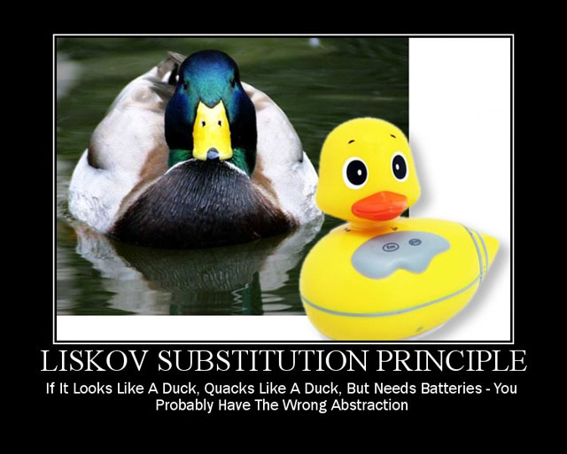

# 19. SOLID tervezési elvek
 


Ebben a tételben nincsen sok magolás, arra fogok törekedni, hogy egy olvasás után vizsgán már tudjatok beszélni a SOLID elvekről.

### Mi az a SOLID?
A `SOLID` egy tervezési elvek nevéből képzett mozaikszó, amit ez a tapasztalt programozási guru `Robert C. Martin` talált ki azért, hogy a szoftverek könnyebben megérthetőek és karbantarthatók maradjanak.
Az elvek:
- `Single Responsibility` principle – Egy felelősség elv
- `Open/Closed` principle (*1980s*) – Nyílt/zárt elv
- `Liskov substitution` principle (*1988*) – Liskov helyettesítési elv
- `Interface segregation` principle – Interface elválasztási elv
- `Dependency inversion` principle – Függőség megfordítási elv

### Mégis mi ez az egész, és mire jó nekünk??

Az épületeket például téglák alkotják, ám ha ezeknek a tégláknak szar a minősége, akkor hiába jó az épület architektúrája, a modulok gyenge minősége miatt összedőlhet.
Ellenben jó alaposan megmunkált téglákkal is lehet nagy rendetlenséget csinálni.

Itt jön képbe a SOLID, ő fogja nekünk megmondani, hogy ezeket az építőelemeket – függvényeket, adatszerkezeteket hogyan rendezzük osztályokba, és azok az osztályok hogyan kommunikáljanak egymással.

Azonban az osztály szó láttán nehogy azt gondold, hogy a SOLID elveket csak objektum-orientált nyelvekre lehet alkalmazni. Az osztály szó mindössze adatok és függvények csoportját jelenti. Minden software system tartalmaz ilyen csoportokat, ha osztálynak hívjuk őket, ha nem.
Na a SOLID elvek ezekere a csoportokra/grouppokra vonatkoznak.
Az elvek célja, hogy egy olyan `mid-level` (kód feletti – modul szintű) software structure-t alkossunk, ami:

- elviseli a változást
- könnyen érthető
- számos szoftverrendszerben használható komponensek alapjai.

## SRP: THE SINGLE RESPONSIBILITY PRINCIPLE

Egy felelősség elve, minden modul/osztály/függvény csak egy dolgot csináljon.

Ha neked is ezek a szavak jutnak eszedbe az SRP-ről, akkor sajnos nem érted ezt az elvet,
ugyanis a SOLID elvek közül ezt értik a legkevésbé az emberek, lehet pont a neve miatt.
Történelmileg az SRP az alábbi módon lett definiálva:

`Egy modulnak egy, és csak egy oka lehet a változásra.`

Egy software system azért változik, hogy kielégítsen bizonyos felhasználói és érdekelt felek igényeit.
Mivel lehet több felhasználó és érdekelt személy is, aki ugyanazt a változtatást szeretné,
így ők egy csoport is lehetnek. Ezet a személyt/személyeket/csoportot a továbbiakban szereplőnek hívjuk. Tehát:

`Egy modul csak egy, és csak egy szereplőnek lehet felelős.`

És mi az a modul? A legegyszerűbb jelentése egy forrásfájl, vagy összefüggő függvények és adatszerkezetek csoportja.
Az összefüggő szó jelenti az `SRP`-t, ezek az összefüggő részek felelősek kizárólag egy `szereplőnek`.
A legjobb módszer, hogy megértsük ezt az elvet az, ha az elv megsértésére nézünk példát.

### Valós üzleti példa

Népszerű példa az `Employee` osztály egy bérszámítás alkalmazásból. 3 metódusa van: `calculatePay()`, `reportHours()`
,`save()`.


Ez az osztály megsérti az `SRP`-t, mivel a 3 metódusa mind kölünböző `szereplőnek` felelős.

- A `calculatePay()` metódust számlázási osztály határozta meg,
  amely a `CFO`-nak (Chief Financial Officer) jelent
- A `reportHours()` metódust az emberi erőforrás osztálya határozta meg,
  amely a `COO`-nak (Chief Operating Officer) jelent.
- A `save()` metódust az adatbázis-adminisztrátorok határozták meg,
  akik jelentést készítenek a technológiai igazgatónak (`CTO` - Chief Technology Officer)

Azzal, hogy a fejlesztők ennek a 3 metódusnak a forráskódját egy `Employee` osztályba rakták,
az osztály változását már 3 különböző szereplő is előidézheti, ezért az osztály 3 szereplőnek felel, mikor az `SRP` szerint csak egynek kellene.

**Noh milyen problémák származhatnak ebből?**

Tegyük fel, hogy a `calculatePay()` és a `regularHours()` mind használnak egy algoritmust a nem-túlórák kiszámítására.
A fejlesztők szemfülesen azzal a céllal, hogy ne duplikálják a kódot,
ezt a logikát egy külön metódusba helyezték `regularHours()` néven.



Ez eddig nagyon szép. Na most tegyük fel, hogy a `CFO` csapata meg akarja változatni a nem-túlórák számításának logikáját.
Ellenben a `COO` nem akarja ezt a változtatást, mert ők mondjuk a nem-túlórákat egy más célra használják.

A fejlesztő megkapja a taskot, hogy programozza le a változást, látja hogy a nyugalmas `regularHours()`-t meghívja a `calculatePay()`
A fejlesztő megcsinálja a változtatást, és ahogy kell, le is teszteli azt. <br>
A `CFO` csapata validálja, hogy a funkció jól működik, és a rendszer telepítve van.

Természetesen a `COO` csapata nem tudja, hogy ez történik, és tovább használják az adatokat, amit a `reportHours()` generál,
de most ez a report helytelen számokat tartalmaz.

Végül megtalálják a problémát, de addigra a `COO`-t már leverte a víz, mivel rossz adatok több millió dollárba dollárjába kerültek a költségvetésnek.

Ehhez hasonló helyzetek már sokszor előfordultak. A problámák akkor keletkeznek,
hogy ha egymás közelébe helyezzük azokat a kódokat,
amelyek különböző szereplőknek felelősek. Az `SRP` azt monndja, hogy szeparáljuk el a kódot,
amikre különböző szereplők hivatkoznak.

### Megoldások

Több megoldás is van a problémára, mindegyik áthelyezi a megtódusokat más osztályokba.

A legegyszerűbb megoldás az adat különválasztása a funkcióktól. A 3 osztály hozzáfér az `EmployeeData` class-hoz,
ami csak egy adatszerkezet metódusok nélkül:



A gond ezzel a megoldással az, hogy a programozónak már 3 osztályt kell ellenőríznie, és példányosítania.
Gyakori megoldás erre a dilemmára a [Homlokzat](https://hu.wikipedia.org/wiki/Homlokzat_programtervez%C3%A9si_minta) tervezési minta:



<br>

## OCP: THE OPEN-CLOSED PRINCIPLE



Az `OCP` 1988-ben lett feltalálva Bertrand Meyer által, és azt mondja ki:

`A szoftvertermék legyen nyílt a kiterjesztésre, de zárt a módosításra.`

Tételezzük fel, hogy van egy osztályunk, aminek definiáltuk a publikus részeit. Az osztályunk nyílt a kiterjesztésre, mert örököltethetünk belőle újabb funkciók beletételével,
de csak akkor lesz zárt a módosításra, ha az eredeti osztály publikus tagjait később nem változtatjuk.

```cs
class A
{
    public void DoSomething()
    {
        //Code
    }
}

class B : A
{
    public void DoSomething()
    {
        //Open Closed violation
    }
}
```

<br>

## LSP: THE LISKOV SUBSTITUTION PRINCIPLE

1988-ban Barbara Liskov ez alábbit írta a leszármazott típusok - altípusok meghatározásához:

`Ami szeretnénk elérni, az a következő helyettesítési tulajdonság: Ha minden S típusú o1 objektumra létezik egy T típusú o2 objektum úgy, hogy minden program P, amely T típusa szerint
lett definiálva, P viselkedése nem változik, amikor o1-t kicseréljük o2-re, akkor S altípusa T-nek`

Ha ezt elmondod vizsgán, nagy király leszel.

### Öröklődés használata

Képzeljük el, hogy van egy `License` osztályunk `calFee()` metódussal, amit meghív a `Billing` alkalmazás.
`Lincense`-nek két altípusa van: `PersonalLicense` és `BusinessLicense`, ők más algoritmust használnak a licensz díj kiszmítására.



Ez a dizájn nem sérti az `LSP`-t mivel a `Billing` alkalmazás nem függ attól, hogy melyik altípust használa,
mindkét altípus helyettesíthető a `License` típussal.

### A négyzet/téglalap probléma

Legnépszerűbb példája a `LSP` megsértésének négyzet/téglalap probléma.



Ebben a példában a négyzet nem egy valid altípusa a téglalapnak,
mivel ha ő egy négyzet, rá nem értelmezhetők a `setHeight()`, `setWidth` függvényke. 



<br>
<br>
<br>
<br>
<br>
<br>


<br>
<br>
<br>
<br>
<br>
<br>
<br>
<br>
<br>

#### Forrás: *Clean Architecture - Robert C. Martin @2018*
