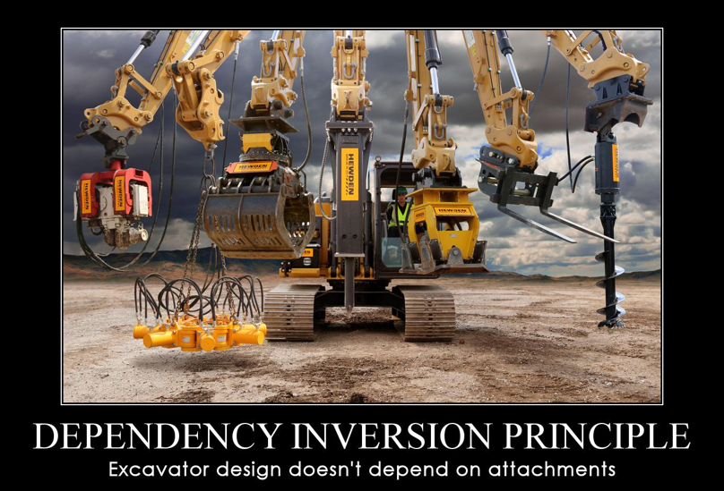
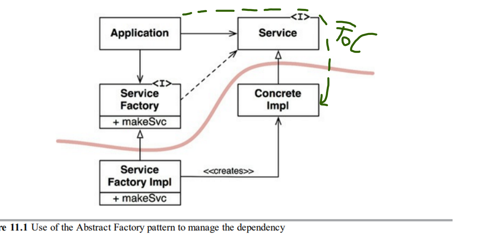
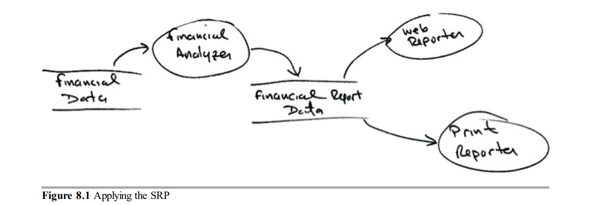
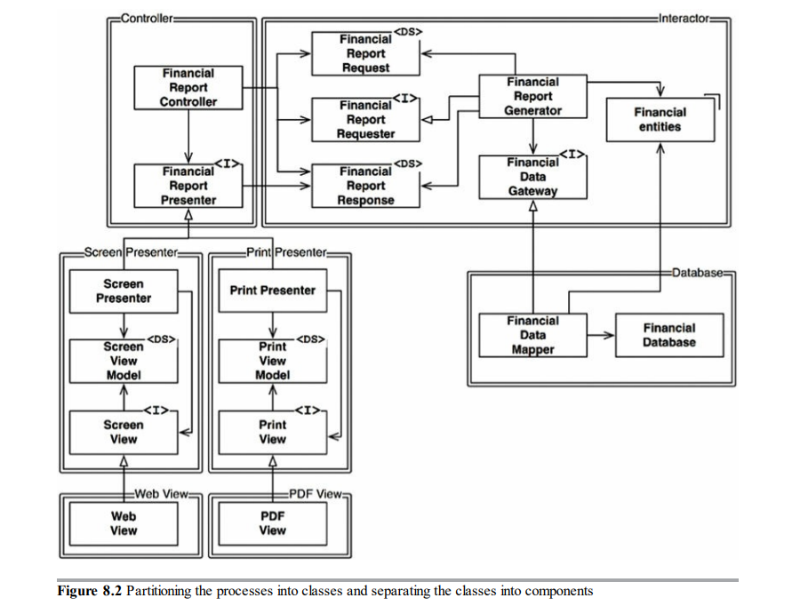
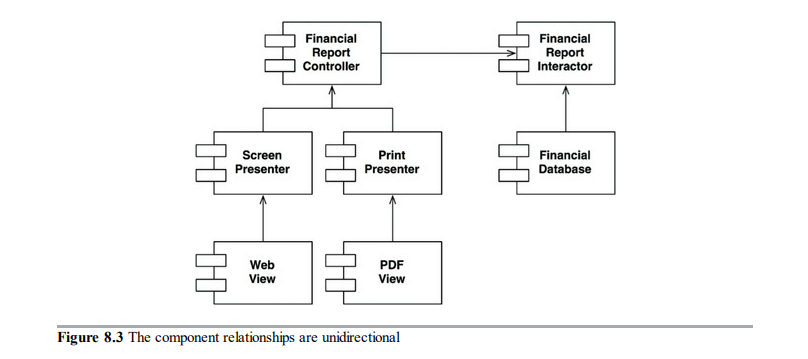
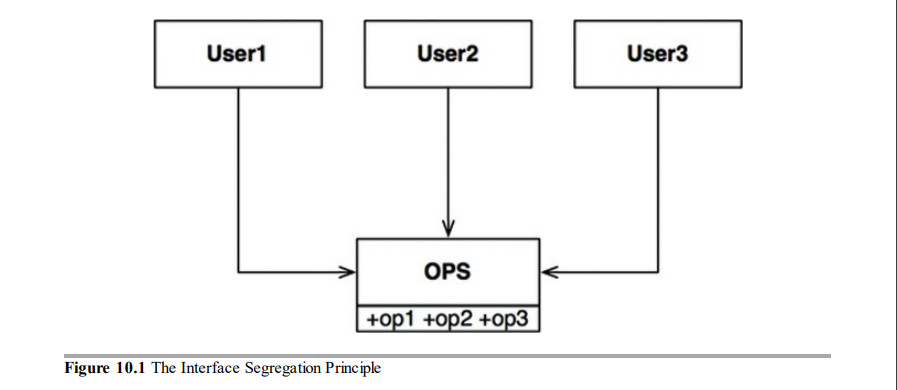
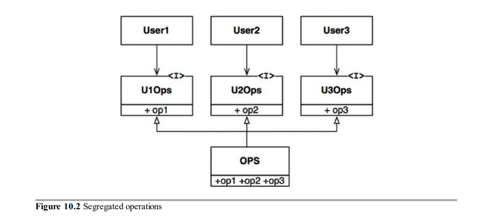
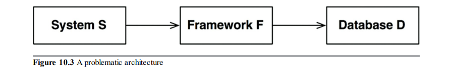

# 19. SOLID tervezési elvek


### Mi az a SOLID?
A `SOLID` egy tervezési elvek nevéből képzett mozaikszó, amit ez a tapasztalt programozási guru `Robert C. Martin` talált ki azért, hogy a szoftverek könnyebben megérthetőek és karbantarthatók maradjanak.
Az elvek:
- `Single Responsibility` principle – Egy felelősség elv
- `Open/Closed` principle (*1980s*) – Nyílt/zárt elv
- `Liskov substitution` principle (*1988*) – Liskov helyettesítési elv
- `Interface segregation` principle – Interface elválasztási elv
- `Dependency inversion` principle – Függőség megfordítási elv

### Mégis mi ez az egész, és mire jó nekünk??

Az épületeket például téglák alkotják, ám ha ezeknek a tégláknak szar a minősége, akkor hiába jó az épület architektúrája, a modulok gyenge minősége miatt összedőlhet.
Ellenben jó alaposan megmunkált téglákkal is lehet nagy rendetlenséget csinálni.

Itt jön képbe a SOLID, ő fogja nekünk megmondani, hogy ezeket az építőelemeket – függvényeket, adatszerkezeteket hogyan rendezzük osztályokba, és azok az osztályok hogyan kommunikáljanak egymással.

Azonban az osztály szó láttán nehogy azt gondold, hogy a SOLID elveket csak objektum-orientált nyelvekre lehet alkalmazni. Az osztály szó mindössze adatok és függvények csoportját jelenti. Minden software system tartalmaz ilyen csoportokat, ha osztálynak hívjuk őket, ha nem.
Na a SOLID elvek ezekere a csoportokra/grouppokra vonatkoznak.
Az elvek célja, hogy egy olyan `mid-level` (kód feletti – modul szintű) software structure-t alkossunk, ami:

- elviseli a változást
- könnyen érthető
- számos szoftverrendszerben használható komponensek alapjai.

## SRP: THE SINGLE RESPONSIBILITY PRINCIPLE


Egy felelősség elve, minden modul/osztály/függvény csak egy dolgot csináljon.

Ha neked is ezek a szavak jutnak eszedbe az SRP-ről, akkor sajnos nem érted ezt az elvet,
ugyanis a SOLID elvek közül ezt értik a legkevésbé az emberek, lehet pont a neve miatt.
Történelmileg az SRP az alábbi módon lett definiálva:

`Egy modulnak egy, és csak egy oka lehet a változásra.`

Egy software system azért változik, hogy kielégítsen bizonyos felhasználói és érdekelt felek igényeit.
Mivel lehet több felhasználó és érdekelt személy is, aki ugyanazt a változtatást szeretné,
így ők egy csoport is lehetnek. Ezt a személyt/személyeket/csoportot a továbbiakban szereplőnek hívjuk. Tehát:

`Egy modul csak egy, és csak egy szereplőnek lehet felelős.`

És mi az a modul? A legegyszerűbb jelentése egy forrásfájl, vagy **összefüggő** függvények és adatszerkezetek csoportja.
Az összefüggő szó jelenti az `SRP`-t, ezek az összefüggő részek felelősek kizárólag egy `szereplőnek`.
A legjobb módszer, hogy megértsük ezt az elvet az, ha az elv megsértésére nézünk példát.

### Valós üzleti példa

Népszerű példa az `Employee` osztály egy bérszámítás alkalmazásból. 3 metódusa van: `calculatePay()`, `reportHours()`
,`save()`.


Ez az osztály megsérti az `SRP`-t, mivel a 3 metódusa mind kölünböző `szereplőnek` felelős.

- A `calculatePay()` metódust a számlázási osztály határozta meg,
  amely a `CFO`-nak (Chief Financial Officer) jelent
- A `reportHours()` metódust az emberi erőforrás osztálya határozta meg,
  amely a `COO`-nak (Chief Operating Officer) jelent.
- A `save()` metódust az adatbázis-adminisztrátorok határozták meg,
  akik jelentést készítenek a technológiai igazgatónak (`CTO` - Chief Technology Officer)

Azzal, hogy a fejlesztők ennek a 3 metódusnak a forráskódját egy `Employee` osztályba rakták,
az osztály változását már 3 különböző szereplő is előidézheti, ezért az osztály 3 szereplőnek felel, mikor az `SRP` szerint csak egynek kellene.

**Noh milyen problémák származhatnak ebből?**

Tegyük fel, hogy a `calculatePay()` és a `regularHours()` mind használnak egy algoritmust a nem-túlórák kiszámítására.
A fejlesztők szemfülesen azzal a céllal, hogy ne duplikálják a kódot,
ezt a logikát egy külön metódusba helyezték `regularHours()` néven.


Ez eddig nagyon szép. Na most tegyük fel, hogy a `CFO` csapata meg akarja változatni a nem-túlórák számításának logikáját.
Ellenben a `COO` nem akarja ezt a változtatást, mert ők mondjuk a nem-túlórákat egy más célra használják.

A fejlesztő megkapja a taskot, hogy programozza le a változást, látja hogy a nyugalmas `regularHours()`-t meghívja a `calculatePay()`
A fejlesztő megcsinálja a változtatást, és ahogy kell, le is teszteli azt. <br>
A `CFO` csapata validálja, hogy a funkció jól működik, és a rendszer telepítve van.


Természetesen a `COO` csapata nem tudja, hogy ez történik, és tovább használják az adatokat, amit a `reportHours()` generál,
de most ez a report helytelen számokat tartalmaz.

Végül megtalálják a problémát, de addigra a `COO`-t már leverte a víz,
mivel rossz adatok több millió dollárjába kerültek a költségvetésnek.

Ehhez hasonló helyzetek már sokszor előfordultak. A problámák akkor keletkeznek,
hogy ha egymás közelébe helyezzük azokat a kódokat,
amelyek különböző szereplőknek felelősek. Az `SRP` azt monndja, hogy szeparáljuk el a kódot,
amikre különböző szereplők hivatkoznak.

### Megoldások

Több megoldás is van a problémára, mindegyik áthelyezi a megtódusokat más osztályokba.

A legegyszerűbb megoldás az adat különválasztása a funkcióktól. A 3 osztály hozzáfér az `EmployeeData` class-hoz,
ami csak egy adatszerkezet metódusok nélkül:


A gond ezzel a megoldással az, hogy a programozónak már 3 osztályt kell ellenőríznie, és példányosítania.
Gyakori megoldás erre a dilemmára a [Homlokzat](https://hu.wikipedia.org/wiki/Homlokzat_programtervez%C3%A9si_minta) tervezési minta,
amely annyit tesz, hogy megcsinálja ennek a 3 osztálynak a példányosítását:


<br>

## DIP: THE DEPENDENCY INVERSION PRINCIPLE



A `SOLID` alapján most az `Open Closed` elv jönne, de ahhoz, hogy a `OCP`-t mélyebben megértsük, először a `DIP`-el kell foglalkoznunk.

A Dependency Inversion Principle (`DIP`), vagy `DI` azt mondja nekünk, hogy a legrugalmasabb rendszerek azok, amelyekben a forráskód-függőségek csak az absztrakciókra vonatkoznak, nem a konkrétumokra.
<br> Tehát a célunk az, hogy a forráskód függőségeink ne konkrét implementációra referáljanak.

`C#`-hoz hasonló statikusan típusos nyelvekben ebben segítenek nekünk mondjuk az interfészek, abstract osztályok.
De ugyanezek az elvek vonatkoznak a dinamikusan típusos nyelvekre is, mint például `Python`, `JS`.

Ezt az elvet sem lehet persze 100%-osan alkalmazni, mivel a programjainknak rengeteg konkrét dologra van szükségük.
Mit értek ilyen konkrét dolgokon. <br> Erre bármilyen osztály lehet példa, mondjuk egy `List<T>`, mert ahhoz hogy ennek a műveleteit érdemben tudjuk használni, szükségünk van konkrét implementációra.
Viszont ez az osztály elég stabil, változtatások ezen az osztályon ritkák,
ezért a programozónak nem kell attól tartania, hogy itt merőben eltérő változások keletkezzenek. <br>
Ugyanezen az elven haladva az operációs rendszerek stabil hátterét is ignorálhatjuk, mivel
számíthatunk arra, hogy ezek a függőségek nem fognak változni.

### Stabil Absztrakciók

Bármilyen változtatás egy interfészen azt vonhatja maga után, hogy az őt implementáló osztályokat is változtatni kell.
Ellenben változtatások a konkrét implementáción ritkán okozzák a kiterjesztve levő interfész változtatását. <br> 
Szóval a jó szoftverfejlesztő azon dolgozik, hogy próbálja minimalizálni ezeknek az interfészeknek a "változékonyságát",
és úgy próbál új funkciót hozzáadni egy osztályhoz, hogy az ő interfészét ne kelljen változatni. Ezt úgy hívják, hogy `Software Design 101`.

Tehát a stabil software architektúra az olyan, ami elkerüli a konkrét implementációktól való függést, és amelyek a stabil absztrakt interfészeket részesítik előnyben.
Ebben egyébként az is segít, ha több specifikus interfészt hozunk létre egy nagy helyet. Mintha lenne is egy ilyen elv:
`ISP: THE INTERFACE SEGREGATION PRINCIPLE` :)

A stable abstraction-höz úgy tudunk még közelebb kerülni, hogy betartjuk a következő paradigmákat, coding practice-ket:

- `Ne hivatkozz változékony konkrét osztályokat`. Referálj absztrakt osztályokat helyette.
- `Ne származtas le változékony konkrét osztályból` Ez főleg statikusan típusos nyelvekben fontos, mivel ott az öröklődés a LEGERŐSEBB és legmerevebb source code dependency (forráskós függőség)
- `Ne írj felül konkrét függvényeket` Konkrét függvényeknek gyakran vannak forráskód függőségeik, és amikor override-olod őket, akkor ezek a függőséget nem szünnek meg, csak öröklöd őket.
  Hogy ezeket a függőségeket kezeld, tedd a függvényt absztrakttá, és implementáld.
- `Ne említsd meg a nevét semminek ami konkrét és változékony.`

### Factories - Gyártók

E szabályok betartása érdekében ezeknek a változékony konkrét osztályoknak a létrehozása speciális kezelést igényel.
Ez az óvatosság indokolt, mert gyakorlatilag minden nyelven az objektum létrehozása forráskód függőséget igényel
objektum konkrét definiciójától.

```cs
class ConcreteImp
{
}

class Application
{
    static void Main()
    {
        ConcreteImp obj = new ConcreteImp();
    }
}
```

Ebben a példában már sikeresen létre is hoztunk egy source code dependency-t. **Ez felháborító!** <br>
Az elv szerint ezt a problémát ki kell küszöbölnünk, na de hogyan? <br>
Ideje megismerni a `DIP` egyik fő szabályát:

`
Dependency Inversion Principle states that, higher-level modules should not depend on the low-level modules,
but rather both should depend on abstractions. And those abstractions should not depend on details.
`

`A függőség megfordítás elv kimondja azt, hogy magas szintű modul nem függhet alacsonyabb szintű modultól,
ellenben mind a kettő absztakciótól függjön. És az absztakció ne függjön a részletektől.`

Mit jelent az a high-level modul? A fenti példában a `static void Main()` az egy high-level module, mivel meghív valamit,
szüksége van a `ConcreteImp` osztályra definiciójára.
Ha a `ConcreteImp` is hivatkozna egy másik osztaly, akkor ő is ugyanolyan egy high-level module lenne.

A legtöbb objetum orientált nyelvben ilyenkor egy `Abstract Factory` tervmintát használunk,
hogy kiküszöböljük a nem kívánt függőséget:

```cs
interface IService
{
}

class ConcreteImp : IService
{
}

interface IServiceFactory
{
    public static IServiceFactory Instance;
    public IService MakeService();
}

class ServiceFactoryImp : IServiceFactory
{
    public IService MakeService() => new ConcreteImp();
}

class Application
{
    static void Main()
    {
        IServiceFactory factory = new ServiceFactoryImp();
        IServiceFactory.Instance = factory;
    }
}
```



A görbe vonal az architektúrális határ, ő választja el a konkrétot az absztrakttól. <br>
Minden forráskód függőség egy irányban kereszteni a körbe vonalat az absztrakt oldal felé.  <br>
Az absztakt oldal tartalmazza az összes high-level biznisz logikát, a konkrét komponensek ezek implementációját.

Nézd meg hogy a vezérlésfolyam (FoC - Flow of Control) a forráskód függőséggel ellentétes irányban keresztezi a görbe vonalat,
ezért nevezik ezt az elvet függőség megfordításnak.

<br>

## OCP: THE OPEN-CLOSED PRINCIPLE


Az `OCP` 1988-ben lett feltalálva Bertrand Meyer által, és azt mondja ki:

`A szoftvertermék legyen nyílt a kiterjesztésre, de zárt a módosításra.`

Tételezzük fel, hogy van egy osztályunk, aminek definiáltuk a publikus részeit. Az osztályunk nyílt a kiterjesztésre, mert örököltethetünk belőle újabb funkciók beletételével,
de csak akkor lesz zárt a módosításra, ha az eredeti osztály publikus tagjait később nem változtatjuk.

```cs
class A
{
    public void DoSomething()
    {
        //Code
    }
}

class B : A
{
    public void DoSomething()
    {
        //Open Closed violation
    }
}
```

### Ez a történet egyszerű része, most nézzük meg az architektúra szempontjából

Képzeljük el, hogy van egy rendszerünk, amely pénzügyi összesítéseket jelenít meg egy weboldalon.
Az adatok görgethetőek, és a negetív számok pirosak. <br>
Most képzeljük el, hogy az egyik szereplő ezt a pénzügyi információt átszeretné alakítani egy jelentésse,
amely aztán kinyomtatható egy fekete-fehér papírra, szép fejlécekkel, láblécekkel, betűtípussal, negatív számok pedig zárójelben jelenjenek meg

Ehhez egyértelműen új kódot kell írni, de mennyire kell megváltoztatni a már meglévő kódót?
A célünk természetesen az, hogy a meglévő kódon minimálisat kelljen módosítani, ideális esetben semmennyit.

Ezt úgy tudjak elérni, hogy először szétválasztjuk a részeket, amelyek különböző okok miatt változnak (az `SRP` elv), és
utána pedig helyesen beállítjuk a függőségeket közöttük (`Dependency Inversion Principle`).

`SRP` alkalmazása után eljuthatunk a kötvetkező adatfolyamig:



Miután ezt a szétválasztást elvégeztük, a forráskód-függőségeket kell rendeznünk úgy,
hogy az egyik függőség változása ne okozzon változást a másikban.
Ezenkívül az új rendszernek biztosítania kell, hogy a viselkedése bővíthető lesz anélkül, hogy változtatni kelljen valamit. (`OCP`)


Ezt úgy érjük el, hogy a feladatokat osztályokba szervezzük, azokat az osztályokat meg komponensekbe.



Ezeket az ábrákat nem kell megtanulni. Csak azért rakom be, hogy lássátok ezt tényleg így kell csinálni, illetve elképzelni is könnyebb. <br>

Na szóval a rendezés után megfigyelhetjük, hogy a kapcsolatok a komponensek között egyirányúak, tehát minden dupla vastag vonal csak egy irányba van keresztezve.

De ugyanezt már a `DIP`-nél is megismertük.

Az, hogy `A` osztályból nyíl mutat `B` osztályba, az azt jelenti,
hogy `A` a forráskódjában megemlíti `B`-t, de `B` nem említ semmit `A`-ról.



Az sem lehet meglepő, hogy amelyik komponensre mutatnak a nyilak, azokat szeretnénk a legjobban megvédeni a változástól.
Itt jön képbe egy újabb szabály:

`Ha [A] komponenst meg akaruk védeni változásoktól [B] komponensben, akkor [B] komponensnek [A]-tól kell függnie.`

- Meg akarjukvédeni a `Controller`-t a `Presenters`-ben való változtatásoktól.
- Meg akarjuk védeni a `Presenters`-t a `View`-ben való változtatásoktól.
- Meg akarjuk védeni a `Interector`-t a változásoktól... mindenben!

Ennek fényében az `Interactor` komponens szolgálja ki legjobban a `OCP`-t,
mivel változtatásoknak a többi komponensekben nincs hatásuk az `Interactor`-ra.
Ez ezért kulcsfontosságú, mivel az `Interactor` tartalmazza a biznisz logikát az alkalmazásunkban.

### Konklúzió

Az `OCP` a rendszerek architektúrájának egyik mozgatórugója. Megkönnyíti a rendszer bővítését anélkül, hogy jelentős változást okozna.
Ezt úgy érjük el, hogy elrendezzük a rendszerünket komponensekbe - `SRP`, és beállítjuk a komponensek között a függőségeket úgy,
hogy a high-level modulokat megvédjünk a low-level modulok okozta változásoktól - `DIP`.

<br>

## LSP: THE LISKOV SUBSTITUTION PRINCIPLE


1988-ban Barbara Liskov az alábbit írta a leszármazott típusok - altípusok meghatározásához:

`Ha minden S típusú o1 objektumra létezik egy T típusú o2 objektum úgy, hogy minden program P, amely T típusa szerint
lett definiálva, P viselkedése nem változik, amikor o1-t kicseréljük o2-re, akkor S altípusa T-nek`

Ha ezt elmondod vizsgán, nagy király leszel, itt van angolul is:

`If for each object o1 of type S
there is an object o2 of type T such that for all programs P defined in terms of T, the behavior of P is
unchanged when o1 is substituted for o2 then S is a subtype of T.
`

Kicsit egyszerűbben:

`Ha S a T altípusa, akkor a programban a T típusú objektumok bármely S típusú objektummal helyettesíthetők.`

`If S is a subtype of T, then objects of type T in a program may be replaced with any objects of type S`

<br>

```cs
class Animal
{
    public virtual void Run() { }
}

class Dog: Animal { }

class Fish : Animal { }
```

A fenti példa megsérti a `LSP` elvet, mivel a halak nem tudnak futni,
tehát rossz az absztrakciónk.

### További példák + Öröklődés használata

Képzeljük el, hogy van egy `License` osztályunk `calFee()` metódussal, amit meghív a `Billing` alkalmazás.
`Lincense`-nek két altípusa van: `PersonalLicense` és `BusinessLicense`, ők más algoritmust használnak a licensz díj kiszmítására.


Ez a dizájn nem sérti az `LSP`-t mivel a `Billing` alkalmazás nem függ attól, hogy melyik altípust használa,
mindkét altípus helyettesíthető a `License` típussal.

### A négyzet/téglalap probléma

Legnépszerűbb példája a `LSP` megsértésének négyzet/téglalap probléma.


Ebben a példában a négyzet nem egy valid altípusa a téglalapnak, mivel a téglalap oldalait egymás függetlenül változtathatjuk,
ellenben a négyzet magasságának és hosszának együtt kell változnia.

```cs
Rectangle r = GetRandomRectangleSubtype(); //visszaad egy osztályt, ami öröklődik a Rectangle-ből
r.SetW(5);
r.SetH(2);
Assert(e.area() == 10);
```

Ha a `GetRandomRectangleSubtype()` egy négyzetet ad vissza, akkor az assertion false-ra fog futni.
Meg eleve hülyeség hogy egy négyzetnet lehet állítani a szélességét és magasságát.

<br>

## ISP: THE INTERFACE SEGREGATION PRINCIPLE


Interfész elválasztási elv. Több specifikus interfész jobb, mint egy általános. <br>
A neve az alábbi ábrából származik:



Ebben a fenti szituációban több felhasználó van, akik az `OPS` osztály operációit használják. Mondjuk hogy a `User1` 
csak az `op1`-et, a `User2` az `op2`, a `User3` meg az `op3`-t használja.
Ha most ezt egy statikusan típusos nyelven írták, akkor a `User1` kódja, annak ellenére, hogy nem hívja meg, de akaratlanul is függni fog az `op2`, `op3`-tól, 
mert ha az `op2` kódjában valamit megváltoztatunk, akkor az `OPS` kényszeríteni fogja az `User1` osztály újrafordítását
pedig őt aztán rohadtul nem érdekelte, hogy az `op2`-ben valami megváltozott, mivel csak az `op1`-t használja.

A megoldás, hogy az operációkat kivezessük interfészekbe, így a `User1`-nek már csak az `U1Ops` interface az egyetlen függősége.



### ISP és az architektúra

Általánosan ártalmas olyan moduloktól függni, amelyket többet tartalmaznak, mint amire szükségünk van. <br>
Nézzük az alábbi példát, a programozó egy rendszeren `S` dolgozik, és hozzá akar rakni egy framework-ot `F`.
Tegyük fel, hogy `F` írói hozzákötötték egy adatbázishoz `D` a framework-ot. <br>
Szóval `S`-nek függősége a `F`, amelynek pedig a `D`. <br>



Most mi a helyzet olyankor, hogyha `D`-nek vannak olyan funkciói, amiket `F` nem használ, ezáltal `S` sem.
Ezeknek a funkcióknak a módosítása `D`-ben `F` újratelepítését eredményezhetik, ezáltal `S`-ét is. <br>
Még rosszabb, ha az egyik funkció meghibásodik, az meghibásodást okozhat az `F` és `S`-ben is.

### Konklúzió

Az alkalmazásunk olyan dolgok
miatt hal meg, amelyek számunkra nem is lennének érdekesek.
Ne függjünk olyan dolgoktól, amikre nincs szükségünk, mert olyan hibákkal találkozhatunk, amikre nem is számítunk.

Az általános `ISP` szabály:

`Egy komponenst soha nem szabad arra kényszeríteni, hogy olyan interfészt implementáljon, amelyet nem használ,
vagy arra kényszeríteni, hogy olyan módszerektől függjön, amelyeket nem használ.`

<br>

## Vége.

Itt még a végén még leírom még1x a fontos szabályokat, amiket mindenképpen elmondanék a vizsgán:

### SRP

`Egy modul csak egy, és csak egy szereplőnek lehet felelős.`

### OCP

`A szoftvertermék legyen nyílt a kiterjesztésre, de zárt a módosításra.`

`Ha [A] komponenst meg akaruk védeni változásoktól [B] komponensben, akkor [B] komponensnek [A]-tól kell függnie.`

### LSP

`Ha minden S típusú o1 objektumra létezik egy T típusú o2 objektum úgy, hogy minden program P,
amely T típusa szerint lett definiálva, P viselkedése nem változik, amikor o1-t kicseréljük o2-re,
akkor S altípusa T-nek`

`Ha S a T altípusa, akkor a programban a T típusú objektumok bármely S típusú objektummal helyettesíthetők.`

### ISP

`Egy komponenst soha nem szabad arra kényszeríteni, hogy olyan interfészt implementáljon, amelyet nem használ,
vagy arra kényszeríteni, hogy olyan módszerektől függjön, amelyeket nem használ.`


### DIP

`A függőség megfordítás elv kimondja azt, hogy magas szintű modul nem függhet alacsonyabb szintű modultól,
ellenben mind a kettő absztakciótól függjön. És az absztakció ne függjön a részletektől.`

<br>


